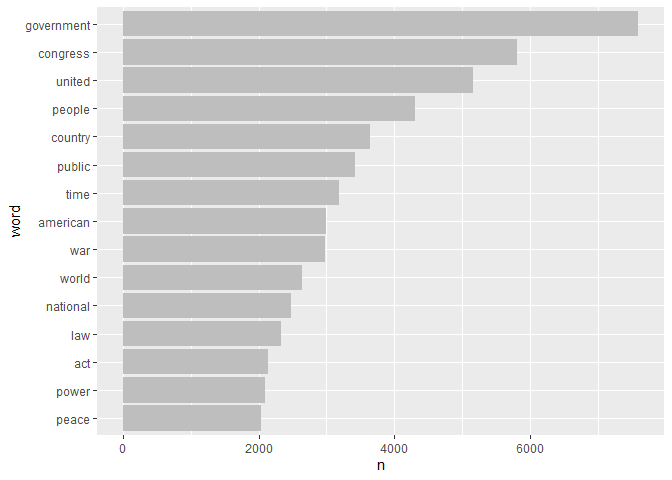
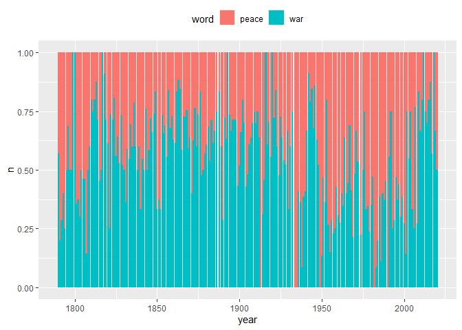
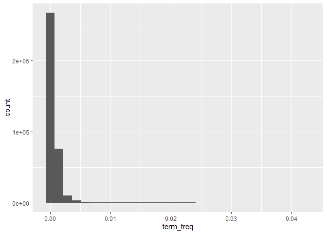
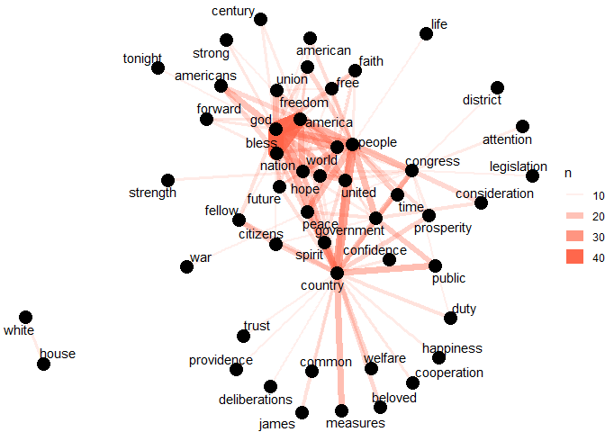
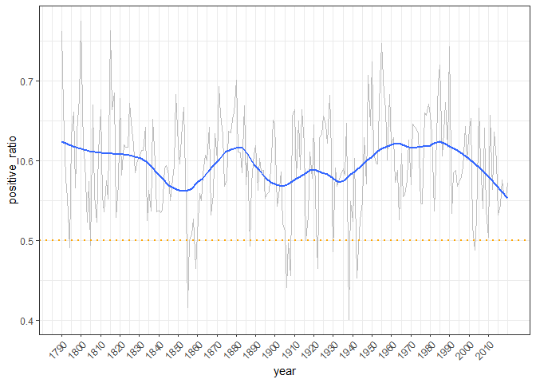

Analyzing Texts
================

``` r
pacman::p_load(
        rio,            # import and export files
        here,           # locate files 
        tidyverse,      # data management and visualization
        tidytext,       # tokenize texts and remove stopwords
        readtext,       # read textual data into R
        sotu,           # metadata and text of State of the Union speeches 
        SnowballC,      # stem words
        widyr,          # calculate co-occurrence
        igraph,         # plot co-occurrence graph
        ggraph,         # plot co-occurrence graph
        tm
)
```

## Data

``` r
sotu_texts <- readtext(sotu_dir())
```

``` r
(sotu_whole <- sotu_meta %>%
                arrange(president) %>%
                bind_cols(sotu_texts) %>%
                as_tibble())
```

    ## # A tibble: 240 × 8
    ##        X president        year years_active party      sotu_type doc_id         text 
    ##    <int> <chr>           <int> <chr>        <chr>      <chr>     <chr>          <chr>
    ##  1    73 Abraham Lincoln  1861 1861-1865    Republican written   abraham-linco… "\n\…
    ##  2    74 Abraham Lincoln  1862 1861-1865    Republican written   abraham-linco… "\n\…
    ##  3    75 Abraham Lincoln  1863 1861-1865    Republican written   abraham-linco… "\n\…
    ##  4    76 Abraham Lincoln  1864 1861-1865    Republican written   abraham-linco… "\n\…
    ##  5    41 Andrew Jackson   1829 1829-1833    Democratic written   andrew-jackso… "\n\…
    ##  6    42 Andrew Jackson   1830 1829-1833    Democratic written   andrew-jackso… "\n\…
    ##  7    43 Andrew Jackson   1831 1829-1833    Democratic written   andrew-jackso… "\n\…
    ##  8    44 Andrew Jackson   1832 1829-1833    Democratic written   andrew-jackso… "\n\…
    ##  9    45 Andrew Jackson   1833 1833-1837    Democratic written   andrew-jackso… "\n\…
    ## 10    46 Andrew Jackson   1834 1833-1837    Democratic written   andrew-jackso… "\n\…
    ## # ℹ 230 more rows

``` r
(tidy_sotu_words <- sotu_whole %>%
        unnest_tokens(word, text) %>%
        anti_join(stop_words))
```

    ## Joining with `by = join_by(word)`

    ## # A tibble: 787,861 × 8
    ##        X president        year years_active party      sotu_type doc_id         word 
    ##    <int> <chr>           <int> <chr>        <chr>      <chr>     <chr>          <chr>
    ##  1    73 Abraham Lincoln  1861 1861-1865    Republican written   abraham-linco… fell…
    ##  2    73 Abraham Lincoln  1861 1861-1865    Republican written   abraham-linco… citi…
    ##  3    73 Abraham Lincoln  1861 1861-1865    Republican written   abraham-linco… sena…
    ##  4    73 Abraham Lincoln  1861 1861-1865    Republican written   abraham-linco… house
    ##  5    73 Abraham Lincoln  1861 1861-1865    Republican written   abraham-linco… repr…
    ##  6    73 Abraham Lincoln  1861 1861-1865    Republican written   abraham-linco… midst
    ##  7    73 Abraham Lincoln  1861 1861-1865    Republican written   abraham-linco… unpr…
    ##  8    73 Abraham Lincoln  1861 1861-1865    Republican written   abraham-linco… poli…
    ##  9    73 Abraham Lincoln  1861 1861-1865    Republican written   abraham-linco… trou…
    ## 10    73 Abraham Lincoln  1861 1861-1865    Republican written   abraham-linco… grat…
    ## # ℹ 787,851 more rows

## Frequencies

Which words occur most frequently?

``` r
tidy_sotu_words %>% count(word, sort = TRUE)
```

    ## # A tibble: 29,875 × 2
    ##    word           n
    ##    <chr>      <int>
    ##  1 government  7597
    ##  2 congress    5808
    ##  3 united      5156
    ##  4 people      4298
    ##  5 country     3641
    ##  6 public      3419
    ##  7 time        3188
    ##  8 american    2988
    ##  9 war         2976
    ## 10 world       2633
    ## # ℹ 29,865 more rows

Make a graph of the words that occur more that 2000 times

``` r
tidy_sotu_words %>%
        count(word, sort = TRUE) %>%
        filter(n > 2000) %>%
        # reorder values by frequency
        mutate(word = reorder(word, n)) %>%
        ggplot(aes(x = n, y = word)) +
        geom_col(fill = "gray")
```

<!-- -->

In any given year, how often is the word ‘peace’ used and how often is
the word ‘war’ used?

``` r
tidy_sotu_words %>%
        # select only the words 'war' and 'peace'
        filter(word %in% c("peace", "war")) %>%
        # count occurrences of each per year
        count(year, word)
```

    ## # A tibble: 442 × 3
    ##     year word      n
    ##    <int> <chr> <int>
    ##  1  1790 peace     3
    ##  2  1790 war       4
    ##  3  1791 peace     4
    ##  4  1791 war       1
    ##  5  1792 peace     5
    ##  6  1792 war       2
    ##  7  1793 peace     6
    ##  8  1793 war       4
    ##  9  1794 peace     3
    ## 10  1794 war       1
    ## # ℹ 432 more rows

``` r
tidy_sotu_words %>%
        filter(word %in% c("peace", "war")) %>%
        count(year, word) %>%
        ggplot(aes(x = year, y = n, fill = word)) +
        # plot n by year, and use position 'fill' to show the proportion
        geom_col(position = "fill") +
        theme(legend.position = "top")
```

<!-- -->

How long was the average speech of each president and who are the most
‘wordy’ presidents?

``` r
# summarize the words per president per speech
tidy_sotu_words %>%
        count(president, doc_id)
```

    ## # A tibble: 240 × 3
    ##    president       doc_id                       n
    ##    <chr>           <chr>                    <int>
    ##  1 Abraham Lincoln abraham-lincoln-1861.txt  2578
    ##  2 Abraham Lincoln abraham-lincoln-1862.txt  3088
    ##  3 Abraham Lincoln abraham-lincoln-1863.txt  2398
    ##  4 Abraham Lincoln abraham-lincoln-1864.txt  2398
    ##  5 Andrew Jackson  andrew-jackson-1829.txt   3849
    ##  6 Andrew Jackson  andrew-jackson-1830.txt   5428
    ##  7 Andrew Jackson  andrew-jackson-1831.txt   2612
    ##  8 Andrew Jackson  andrew-jackson-1832.txt   2881
    ##  9 Andrew Jackson  andrew-jackson-1833.txt   2869
    ## 10 Andrew Jackson  andrew-jackson-1834.txt   4952
    ## # ℹ 230 more rows

``` r
# calculate the average number of words per speech
tidy_sotu_words %>%
        count(president, doc_id) %>%
        group_by(president) %>%
        summarise(avg_words = mean(n)) %>%
        arrange(desc(avg_words))
```

    ## # A tibble: 42 × 2
    ##    president           avg_words
    ##    <chr>                   <dbl>
    ##  1 William Howard Taft     9126.
    ##  2 William McKinley        7797 
    ##  3 Jimmy Carter            7674.
    ##  4 Theodore Roosevelt      7356 
    ##  5 James K. Polk           6920.
    ##  6 Grover Cleveland        5736.
    ##  7 James Buchanan          5409 
    ##  8 Benjamin Harrison       5308.
    ##  9 Rutherford B. Hayes     4411 
    ## 10 Martin Van Buren        4286.
    ## # ℹ 32 more rows

## Term frequency

``` r
# count term frequency
tidy_sotu_words %>%
        count(doc_id, word, sort = TRUE) %>%
        group_by(doc_id) %>%
        mutate(n_total = sum(n),
               term_freq = n/n_total)
```

    ## # A tibble: 358,168 × 5
    ## # Groups:   doc_id [240]
    ##    doc_id                       word               n n_total term_freq
    ##    <chr>                        <chr>          <int>   <int>     <dbl>
    ##  1 harry-s-truman-1946.txt      dollars          207   12615   0.0164 
    ##  2 jimmy-carter-1980b.txt       congress         204   16132   0.0126 
    ##  3 harry-s-truman-1946.txt      war              201   12615   0.0159 
    ##  4 william-howard-taft-1910.txt government       164   11178   0.0147 
    ##  5 james-k-polk-1846.txt        mexico           158    7023   0.0225 
    ##  6 richard-m-nixon-1974b.txt    federal          141    9996   0.0141 
    ##  7 harry-s-truman-1946.txt      million          138   12615   0.0109 
    ##  8 harry-s-truman-1946.txt      fiscal           129   12615   0.0102 
    ##  9 jimmy-carter-1981.txt        administration   129   16595   0.00777
    ## 10 william-howard-taft-1912.txt government       129   10215   0.0126 
    ## # ℹ 358,158 more rows

``` r
# plot the distribution of the term frequency for the speeches
tidy_sotu_words %>%
        count(doc_id, word) %>%
        group_by(doc_id) %>%
        mutate(n_total = sum(n),
               term_freq = n/n_total) %>%
        ggplot(aes(term_freq)) +
        geom_histogram()
```

    ## `stat_bin()` using `bins = 30`. Pick better value with `binwidth`.

<!-- -->

Find the term with the highest term frequency for each president

``` r
tidy_sotu_words %>%
        count(president, word) %>%
        group_by(president) %>%
        mutate(n_total = sum(n),
               term_freq = n/n_total) %>%
        arrange(desc(term_freq)) %>%
        # take the top for each president
        top_n(1) %>%
        # print all rows
        print(n = Inf)
```

    ## Selecting by term_freq

    ## # A tibble: 44 × 5
    ## # Groups:   president [42]
    ##    president             word           n n_total term_freq
    ##    <chr>                 <chr>      <int>   <int>     <dbl>
    ##  1 John Adams            united        49    2768   0.0177 
    ##  2 John Tyler            government   209   12596   0.0166 
    ##  3 Martin Van Buren      government   256   17145   0.0149 
    ##  4 William J. Clinton    people       336   22713   0.0148 
    ##  5 Franklin D. Roosevelt war          283   19311   0.0147 
    ##  6 William McKinley      government   452   31188   0.0145 
    ##  7 Andrew Jackson        government   436   31031   0.0141 
    ##  8 Donald Trump          american     135    9690   0.0139 
    ##  9 Andrew Johnson        government   207   14968   0.0138 
    ## 10 George Washington     united        86    6226   0.0138 
    ## 11 Calvin Coolidge       government   274   20518   0.0134 
    ## 12 James K. Polk         mexico       360   27679   0.0130 
    ## 13 James Buchanan        government   279   21636   0.0129 
    ## 14 Zachary Taylor        congress      38    2948   0.0129 
    ## 15 Ulysses S. Grant      united       359   27933   0.0129 
    ## 16 William Howard Taft   government   461   36506   0.0126 
    ## 17 Grover Cleveland      government   574   45889   0.0125 
    ## 18 Franklin Pierce       united       200   16240   0.0123 
    ## 19 George Bush           world         82    6706   0.0122 
    ## 20 James Monroe          united       184   15157   0.0121 
    ## 21 George W. Bush        america      209   17265   0.0121 
    ## 22 Millard Fillmore      government   135   11986   0.0113 
    ## 23 John Quincy Adams     congress     131   11788   0.0111 
    ## 24 Harry S Truman        war          308   27820   0.0111 
    ## 25 Gerald R. Ford        federal       65    5879   0.0111 
    ## 26 Herbert Hoover        government   121   10947   0.0111 
    ## 27 Rutherford B. Hayes   congress     194   17644   0.0110 
    ## 28 Chester A. Arthur     government   185   16961   0.0109 
    ## 29 Lyndon B. Johnson     congress     115   11207   0.0103 
    ## 30 James Madison         war           85    8327   0.0102 
    ## 31 Barack Obama          america      204   20529   0.00994
    ## 32 Benjamin Harrison     government   209   21230   0.00984
    ## 33 Richard M. Nixon      federal      232   23701   0.00979
    ## 34 Jimmy Carter          congress     518   53719   0.00964
    ## 35 John F. Kennedy       world         68    7302   0.00931
    ## 36 Theodore Roosevelt    government   528   58848   0.00897
    ## 37 Ronald Reagan         government   133   15005   0.00886
    ## 38 Ronald Reagan         people       133   15005   0.00886
    ## 39 Woodrow Wilson        government   105   11982   0.00876
    ## 40 Warren G. Harding     public        39    4583   0.00851
    ## 41 Dwight D. Eisenhower  world        204   24410   0.00836
    ## 42 Thomas Jefferson      country       58    7418   0.00782
    ## 43 Abraham Lincoln       congress      81   10462   0.00774
    ## 44 Abraham Lincoln       united        81   10462   0.00774

Pick one president. For each of his speeches, which is the term with
highest term frequency?

``` r
tidy_sotu_words %>%
        filter(president == "Barack Obama") %>%
        count(doc_id, word) %>%
        group_by(doc_id) %>%
        mutate(n_total = sum(n),
               term_freq = n/n_total) %>%
        arrange(desc(term_freq)) %>%
        top_n(1)
```

    ## Selecting by term_freq

    ## # A tibble: 8 × 5
    ## # Groups:   doc_id [8]
    ##   doc_id                word         n n_total term_freq
    ##   <chr>                 <chr>    <int>   <int>     <dbl>
    ## 1 barack-obama-2015.txt america     35    2568    0.0136
    ## 2 barack-obama-2016.txt america     28    2153    0.0130
    ## 3 barack-obama-2012.txt american    35    2740    0.0128
    ## 4 barack-obama-2011.txt people      31    2540    0.0122
    ## 5 barack-obama-2014.txt america     33    2791    0.0118
    ## 6 barack-obama-2013.txt jobs        32    2726    0.0117
    ## 7 barack-obama-2010.txt people      32    2753    0.0116
    ## 8 barack-obama-2009.txt american    26    2258    0.0115

## tf-idf

``` r
tidy_sotu_words %>%
        count(doc_id, word, sort = TRUE) %>%
        bind_tf_idf(word, doc_id, n)
```

    ## # A tibble: 358,168 × 6
    ##    doc_id                       word               n      tf     idf    tf_idf
    ##    <chr>                        <chr>          <int>   <dbl>   <dbl>     <dbl>
    ##  1 harry-s-truman-1946.txt      dollars          207 0.0164  0.598   0.00981  
    ##  2 jimmy-carter-1980b.txt       congress         204 0.0126  0.00418 0.0000528
    ##  3 harry-s-truman-1946.txt      war              201 0.0159  0.0339  0.000540 
    ##  4 william-howard-taft-1910.txt government       164 0.0147  0.00418 0.0000613
    ##  5 james-k-polk-1846.txt        mexico           158 0.0225  0.799   0.0180   
    ##  6 richard-m-nixon-1974b.txt    federal          141 0.0141  0.293   0.00414  
    ##  7 harry-s-truman-1946.txt      million          138 0.0109  0.710   0.00777  
    ##  8 harry-s-truman-1946.txt      fiscal           129 0.0102  0.511   0.00522  
    ##  9 jimmy-carter-1981.txt        administration   129 0.00777 0.277   0.00215  
    ## 10 william-howard-taft-1912.txt government       129 0.0126  0.00418 0.0000527
    ## # ℹ 358,158 more rows

Words in the corpus that have the highest tf-idf scores, which means
words that are particularly distinctive for their documents.

``` r
tidy_sotu_words %>%
        count(doc_id, word, sort = TRUE)  %>% 
        bind_tf_idf(word, doc_id, n) %>% 
        arrange(desc(tf_idf))
```

    ## # A tibble: 358,168 × 6
    ##    doc_id                        word          n      tf   idf tf_idf
    ##    <chr>                         <chr>     <int>   <dbl> <dbl>  <dbl>
    ##  1 donald-trump-2019.txt         applause    104 0.0424   2.22 0.0942
    ##  2 lyndon-b-johnson-1966.txt     vietnam      32 0.0152   2.35 0.0356
    ##  3 jimmy-carter-1980a.txt        soviet       31 0.0218   1.49 0.0325
    ##  4 george-w-bush-2003.txt        hussein      19 0.00811  3.87 0.0314
    ##  5 george-w-bush-2003.txt        saddam       19 0.00811  3.69 0.0299
    ##  6 franklin-d-roosevelt-1943.txt 1942         13 0.00758  3.87 0.0294
    ##  7 dwight-d-eisenhower-1961.txt  1953         23 0.00747  3.87 0.0289
    ##  8 john-adams-1800.txt           gentlemen     8 0.0153   1.77 0.0270
    ##  9 benjamin-harrison-1892.txt    1892         40 0.00741  3.53 0.0262
    ## 10 franklin-d-roosevelt-1942.txt hitler        7 0.00527  4.79 0.0252
    ## # ℹ 358,158 more rows

Pick the same president you chose above. For each of his speeches, which
is the term with highest tf-idf?

``` r
tidy_sotu_words %>%
        filter(president == "Barack Obama") %>%
        count(doc_id, word, sort = TRUE) %>%
        bind_tf_idf(word, doc_id, n) %>%
        arrange(desc(tf_idf)) %>%
        group_by(doc_id) %>% 
        top_n(1)
```

    ## Selecting by tf_idf

    ## # A tibble: 9 × 6
    ## # Groups:   doc_id [8]
    ##   doc_id                word          n      tf   idf  tf_idf
    ##   <chr>                 <chr>     <int>   <dbl> <dbl>   <dbl>
    ## 1 barack-obama-2016.txt voices        8 0.00372  2.08 0.00773
    ## 2 barack-obama-2014.txt cory          9 0.00322  2.08 0.00671
    ## 3 barack-obama-2015.txt rebekah       7 0.00273  2.08 0.00567
    ## 4 barack-obama-2012.txt unit          7 0.00255  2.08 0.00531
    ## 5 barack-obama-2009.txt restart       5 0.00221  2.08 0.00460
    ## 6 barack-obama-2013.txt reduction     6 0.00220  2.08 0.00458
    ## 7 barack-obama-2011.txt brandon       5 0.00197  2.08 0.00409
    ## 8 barack-obama-2010.txt division      4 0.00145  2.08 0.00302
    ## 9 barack-obama-2010.txt hated         4 0.00145  2.08 0.00302

## N-Grams: sequences of words

``` r
sotu_whole %>%
        # create bigrams
        unnest_tokens(bigram, text, token = "ngrams", n = 2) %>%
        select(!c(sotu_type, years_active))
```

    ## # A tibble: 1,987,986 × 6
    ##        X president        year party      doc_id                   bigram            
    ##    <int> <chr>           <int> <chr>      <chr>                    <chr>             
    ##  1    73 Abraham Lincoln  1861 Republican abraham-lincoln-1861.txt fellow citizens   
    ##  2    73 Abraham Lincoln  1861 Republican abraham-lincoln-1861.txt citizens of       
    ##  3    73 Abraham Lincoln  1861 Republican abraham-lincoln-1861.txt of the            
    ##  4    73 Abraham Lincoln  1861 Republican abraham-lincoln-1861.txt the senate        
    ##  5    73 Abraham Lincoln  1861 Republican abraham-lincoln-1861.txt senate and        
    ##  6    73 Abraham Lincoln  1861 Republican abraham-lincoln-1861.txt and house         
    ##  7    73 Abraham Lincoln  1861 Republican abraham-lincoln-1861.txt house of          
    ##  8    73 Abraham Lincoln  1861 Republican abraham-lincoln-1861.txt of representatives
    ##  9    73 Abraham Lincoln  1861 Republican abraham-lincoln-1861.txt representatives in
    ## 10    73 Abraham Lincoln  1861 Republican abraham-lincoln-1861.txt in the            
    ## # ℹ 1,987,976 more rows

``` r
# most common bigrams
sotu_whole %>%
        unnest_tokens(bigram, text, token = "ngrams", n = 2) %>% 
        count(bigram, sort = TRUE) # count occurrences and sort descending
```

    ## # A tibble: 475,217 × 2
    ##    bigram            n
    ##    <chr>         <int>
    ##  1 of the        33699
    ##  2 in the        12608
    ##  3 to the        11684
    ##  4 for the        6926
    ##  5 and the        6265
    ##  6 by the         5625
    ##  7 of our         5219
    ##  8 the united     4816
    ##  9 united states  4808
    ## 10 it is          4774
    ## # ℹ 475,207 more rows

``` r
# remove stopwords
sotu_whole %>%
        unnest_tokens(bigram, text, token = "ngrams", n = 2) %>%
        separate(col = bigram,
                 into = c("word1", "word2"),
                 sep = " ") %>%
        select(!c(years_active, sotu_type))
```

    ## # A tibble: 1,987,986 × 7
    ##        X president        year party      doc_id                   word1        word2
    ##    <int> <chr>           <int> <chr>      <chr>                    <chr>        <chr>
    ##  1    73 Abraham Lincoln  1861 Republican abraham-lincoln-1861.txt fellow       citi…
    ##  2    73 Abraham Lincoln  1861 Republican abraham-lincoln-1861.txt citizens     of   
    ##  3    73 Abraham Lincoln  1861 Republican abraham-lincoln-1861.txt of           the  
    ##  4    73 Abraham Lincoln  1861 Republican abraham-lincoln-1861.txt the          sena…
    ##  5    73 Abraham Lincoln  1861 Republican abraham-lincoln-1861.txt senate       and  
    ##  6    73 Abraham Lincoln  1861 Republican abraham-lincoln-1861.txt and          house
    ##  7    73 Abraham Lincoln  1861 Republican abraham-lincoln-1861.txt house        of   
    ##  8    73 Abraham Lincoln  1861 Republican abraham-lincoln-1861.txt of           repr…
    ##  9    73 Abraham Lincoln  1861 Republican abraham-lincoln-1861.txt representat… in   
    ## 10    73 Abraham Lincoln  1861 Republican abraham-lincoln-1861.txt in           the  
    ## # ℹ 1,987,976 more rows

``` r
# select only the words in each column that are not in the stopwords
sotu_whole %>%
        unnest_tokens(bigram, text, token = "ngrams", n = 2) %>%
        separate(col = bigram,
                 into = c("word1", "word2"),
                 sep = " ") %>%
        filter(!word1 %in% stop_words$word,
               !word2 %in% stop_words$word)
```

    ## # A tibble: 219,472 × 9
    ##        X president        year years_active party      sotu_type doc_id   word1 word2
    ##    <int> <chr>           <int> <chr>        <chr>      <chr>     <chr>    <chr> <chr>
    ##  1    73 Abraham Lincoln  1861 1861-1865    Republican written   abraham… fell… citi…
    ##  2    73 Abraham Lincoln  1861 1861-1865    Republican written   abraham… unpr… poli…
    ##  3    73 Abraham Lincoln  1861 1861-1865    Republican written   abraham… poli… trou…
    ##  4    73 Abraham Lincoln  1861 1861-1865    Republican written   abraham… abun… harv…
    ##  5    73 Abraham Lincoln  1861 1861-1865    Republican written   abraham… pecu… exig…
    ##  6    73 Abraham Lincoln  1861 1861-1865    Republican written   abraham… fore… nati…
    ##  7    73 Abraham Lincoln  1861 1861-1865    Republican written   abraham… prof… soli…
    ##  8    73 Abraham Lincoln  1861 1861-1865    Republican written   abraham… soli… chie…
    ##  9    73 Abraham Lincoln  1861 1861-1865    Republican written   abraham… dome… affa…
    ## 10    73 Abraham Lincoln  1861 1861-1865    Republican written   abraham… disl… port…
    ## # ℹ 219,462 more rows

``` r
# re-unite the two word columns into bigrams
(sotu_bigrams <- sotu_whole %>%
        unnest_tokens(bigram, text, token = "ngrams", n = 2) %>%
        separate(col = bigram,
                 into = c("word1", "word2"),
                 sep = " ") %>%
        filter(!word1 %in% stop_words$word,
               !word2 %in% stop_words$word) %>%
        unite(col = bigram,
              word1, word2,
              sep = " "))
```

    ## # A tibble: 219,472 × 8
    ##        X president        year years_active party      sotu_type doc_id                   bigram                 
    ##    <int> <chr>           <int> <chr>        <chr>      <chr>     <chr>                    <chr>                  
    ##  1    73 Abraham Lincoln  1861 1861-1865    Republican written   abraham-lincoln-1861.txt fellow citizens        
    ##  2    73 Abraham Lincoln  1861 1861-1865    Republican written   abraham-lincoln-1861.txt unprecedented political
    ##  3    73 Abraham Lincoln  1861 1861-1865    Republican written   abraham-lincoln-1861.txt political troubles     
    ##  4    73 Abraham Lincoln  1861 1861-1865    Republican written   abraham-lincoln-1861.txt abundant harvests      
    ##  5    73 Abraham Lincoln  1861 1861-1865    Republican written   abraham-lincoln-1861.txt peculiar exigencies    
    ##  6    73 Abraham Lincoln  1861 1861-1865    Republican written   abraham-lincoln-1861.txt foreign nations        
    ##  7    73 Abraham Lincoln  1861 1861-1865    Republican written   abraham-lincoln-1861.txt profound solicitude    
    ##  8    73 Abraham Lincoln  1861 1861-1865    Republican written   abraham-lincoln-1861.txt solicitude chiefly     
    ##  9    73 Abraham Lincoln  1861 1861-1865    Republican written   abraham-lincoln-1861.txt domestic affairs       
    ## 10    73 Abraham Lincoln  1861 1861-1865    Republican written   abraham-lincoln-1861.txt disloyal portion       
    ## # ℹ 219,462 more rows

``` r
sotu_bigrams %>% count(bigram, sort = TRUE)
```

    ## # A tibble: 131,892 × 2
    ##    bigram                 n
    ##    <chr>              <int>
    ##  1 federal government   479
    ##  2 american people      439
    ##  3 june 30              325
    ##  4 fellow citizens      302
    ##  5 public debt          283
    ##  6 public lands         256
    ##  7 health care          253
    ##  8 social security      233
    ##  9 post office          202
    ## 10 annual message       200
    ## # ℹ 131,882 more rows

For each president, which is the bigram with highest tf-idf?

``` r
sotu_bigrams %>%
        count(president, bigram) %>%
        bind_tf_idf(bigram, president, n) %>%
        group_by(president) %>%
        arrange(desc(tf_idf)) %>%
        top_n(1) %>%
        print(n = Inf)
```

    ## Selecting by tf_idf

    ## # A tibble: 45 × 6
    ## # Groups:   president [42]
    ##    president             bigram                      n      tf   idf  tf_idf
    ##    <chr>                 <chr>                   <int>   <dbl> <dbl>   <dbl>
    ##  1 John Adams            john adams                  3 0.00510 3.74  0.0191 
    ##  2 George W. Bush        al qaida                   35 0.00628 2.64  0.0166 
    ##  3 Thomas Jefferson      gun boats                   7 0.00462 3.04  0.0141 
    ##  4 Thomas Jefferson      port towns                  7 0.00462 3.04  0.0141 
    ##  5 Thomas Jefferson      sea port                    7 0.00462 3.04  0.0141 
    ##  6 William J. Clinton    21st century               59 0.00830 1.66  0.0138 
    ##  7 Zachary Taylor        german empire               5 0.00789 1.66  0.0131 
    ##  8 Lyndon B. Johnson     south vietnam              13 0.00424 3.04  0.0129 
    ##  9 James Madison         james madison               8 0.00412 3.04  0.0125 
    ## 10 Harry S Truman        million dollars           119 0.0129  0.965 0.0124 
    ## 11 John Quincy Adams     01 01                      12 0.00450 2.64  0.0119 
    ## 12 Warren G. Harding     railway managers            4 0.00311 3.74  0.0116 
    ## 13 Barack Obama          clean energy               28 0.00477 2.35  0.0112 
    ## 14 William McKinley      military governor          26 0.00293 3.74  0.0109 
    ## 15 John F. Kennedy       common market               8 0.00343 3.04  0.0104 
    ## 16 John F. Kennedy       viet nam                    8 0.00343 3.04  0.0104 
    ## 17 John Tyler            treasury notes             20 0.00764 1.34  0.0102 
    ## 18 Gerald R. Ford        crude oil                   7 0.00335 3.04  0.0102 
    ## 19 Woodrow Wilson        coast submarines            7 0.00271 3.74  0.0101 
    ## 20 Abraham Lincoln       free colored                7 0.00256 3.74  0.00957
    ## 21 James Buchanan        30 1860                    13 0.00255 3.74  0.00953
    ## 22 Rutherford B. Hayes   legal tender               22 0.00490 1.79  0.00877
    ## 23 Richard M. Nixon      revenue sharing            26 0.00332 2.64  0.00875
    ## 24 Donald Trump          usa usa                     8 0.00230 3.74  0.00859
    ## 25 George Bush           capital gains               8 0.00401 2.13  0.00854
    ## 26 Dwight D. Eisenhower  free world                 43 0.00500 1.66  0.00828
    ## 27 Martin Van Buren      public money               28 0.00705 1.17  0.00827
    ## 28 James Monroe          james monroe                8 0.00264 3.04  0.00803
    ## 29 Franklin D. Roosevelt national service           21 0.00395 1.95  0.00769
    ## 30 George Washington     military stores             3 0.00237 3.04  0.00723
    ## 31 Herbert Hoover        farm board                  8 0.00233 3.04  0.00711
    ## 32 Millard Fillmore      september 1850              6 0.00231 3.04  0.00704
    ## 33 Benjamin Harrison     30 1891                    10 0.00186 3.74  0.00696
    ## 34 William Howard Taft   tariff board               19 0.00184 3.74  0.00688
    ## 35 James K. Polk         mexican government         43 0.00677 0.965 0.00654
    ## 36 Franklin Pierce       domestic institutions      11 0.00274 2.35  0.00643
    ## 37 Chester A. Arthur     establishment including    10 0.00217 2.64  0.00573
    ## 38 Theodore Roosevelt    interstate commerce        69 0.00452 1.25  0.00567
    ## 39 Andrew Jackson        01 01                      14 0.00211 2.64  0.00558
    ## 40 Ronald Reagan         freedom fighters            7 0.00139 3.74  0.00521
    ## 41 Andrew Johnson        depreciated paper           8 0.00217 2.35  0.00510
    ## 42 Calvin Coolidge       shipping board              9 0.00158 3.04  0.00482
    ## 43 Ulysses S. Grant      transmitted herewith       10 0.00150 3.04  0.00456
    ## 44 Jimmy Carter          soviet union               75 0.00347 1.25  0.00434
    ## 45 Grover Cleveland      fine ounces                14 0.00113 3.74  0.00423

Pick the same president you chose above. For each of his speeches, which
is the bigram with highest tf-idf?

``` r
sotu_whole %>%
        filter(president == "Barack Obama") %>%
        unnest_tokens(bigram, text, token = "ngrams", n = 2) %>%
        separate(col = bigram,
                 into = c("word1", "word2"),
                 sep = " ") %>%
        filter(!word1 %in% stop_words$word,
               !word2 %in% stop_words$word) %>%
        unite(col = bigram,
              word1, word2,
              sep = " ") %>%
        count(doc_id, bigram) %>%
        bind_tf_idf(bigram, doc_id, n) %>%
        group_by(doc_id) %>%
        arrange(desc(tf_idf)) %>%
        top_n(1)
```

    ## Selecting by tf_idf

    ## # A tibble: 13 × 6
    ## # Groups:   doc_id [8]
    ##    doc_id                bigram                     n      tf   idf  tf_idf
    ##    <chr>                 <chr>                  <int>   <dbl> <dbl>   <dbl>
    ##  1 barack-obama-2009.txt recovery plan              8 0.0135   2.08 0.0280 
    ##  2 barack-obama-2010.txt cut taxes                  6 0.00763  2.08 0.0159 
    ##  3 barack-obama-2010.txt recovery act               6 0.00763  2.08 0.0159 
    ##  4 barack-obama-2013.txt deficit reduction          6 0.00713  2.08 0.0148 
    ##  5 barack-obama-2015.txt class economics            5 0.00664  2.08 0.0138 
    ##  6 barack-obama-2015.txt sick leave                 5 0.00664  2.08 0.0138 
    ##  7 barack-obama-2016.txt past 7                     3 0.00512  2.08 0.0106 
    ##  8 barack-obama-2016.txt public life                3 0.00512  2.08 0.0106 
    ##  9 barack-obama-2014.txt american diplomacy         4 0.00461  2.08 0.00959
    ## 10 barack-obama-2011.txt domestic spending          3 0.00449  2.08 0.00934
    ## 11 barack-obama-2012.txt america built              3 0.00384  2.08 0.00799
    ## 12 barack-obama-2012.txt american manufacturing     3 0.00384  2.08 0.00799
    ## 13 barack-obama-2012.txt economy built              3 0.00384  2.08 0.00799

## Co-occurrence

Which words occur most commonly together at the end of the speeches?

``` r
(sotu_word_pairs <- sotu_whole %>%
        # extract last 100 words
        mutate(speech_end = word(text, -100, end = -1)) %>%
        # tokenize
        unnest_tokens(word, speech_end) %>%
        # remove stopwords %>%
        filter(!word %in% stop_words$word) %>%
        # don't include upper triangle of matrix
        pairwise_count(word, doc_id, sort = TRUE, upper = FALSE))
```

    ## # A tibble: 126,853 × 3
    ##    item1      item2       n
    ##    <chr>      <chr>   <dbl>
    ##  1 god        bless      41
    ##  2 god        america    39
    ##  3 bless      america    34
    ##  4 people     country    27
    ##  5 god        nation     24
    ##  6 world      god        23
    ##  7 god        people     23
    ##  8 god        country    22
    ##  9 people     america    22
    ## 10 government people     21
    ## # ℹ 126,843 more rows

Visualize the co-occurrence network of words that occur together at the
end of 10 or more speeches.

``` r
sotu_word_pairs %>%
        # only word pairs that occur 10 or more times
        filter(n >= 10) %>%
        #convert to graph
        graph_from_data_frame() %>%
        # place nodes according to the force-directed algorithm of Fruchterman and Reingold
        ggraph(layout = "fr") +
        geom_edge_link(aes(edge_alpha = n,
                           edge_width = n),
                       edge_colour = "tomato") +
        geom_node_point(size = 5) +
        geom_node_text(aes(label = name),
                       repel = TRUE, 
                       point.padding = unit(0.2, "lines")) +
        theme_void()
```

    ## Warning: The `trans` argument of `continuous_scale()` is deprecated as of ggplot2 3.5.0.
    ## ℹ Please use the `transform` argument instead.
    ## This warning is displayed once every 8 hours.
    ## Call `lifecycle::last_lifecycle_warnings()` to see where this warning was generated.

<!-- -->

## Document-Term Matrix

``` r
# make a table with document, term, count
tidy_sotu_words %>% 
        count(doc_id, word) 
```

    ## # A tibble: 358,168 × 3
    ##    doc_id                   word               n
    ##    <chr>                    <chr>          <int>
    ##  1 abraham-lincoln-1861.txt 1,470,018          1
    ##  2 abraham-lincoln-1861.txt 1,500              1
    ##  3 abraham-lincoln-1861.txt 100,000            1
    ##  4 abraham-lincoln-1861.txt 102,532,509.27     1
    ##  5 abraham-lincoln-1861.txt 12,528,000         1
    ##  6 abraham-lincoln-1861.txt 13,606,759.11      1
    ##  7 abraham-lincoln-1861.txt 1830               1
    ##  8 abraham-lincoln-1861.txt 1859               1
    ##  9 abraham-lincoln-1861.txt 1860               2
    ## 10 abraham-lincoln-1861.txt 1861               6
    ## # ℹ 358,158 more rows

``` r
(sotu_dtm <- tidy_sotu_words %>% 
        count(doc_id, word) %>% 
        cast_dtm(doc_id, word, n))
```

    ## <<DocumentTermMatrix (documents: 240, terms: 29875)>>
    ## Non-/sparse entries: 358168/6811832
    ## Sparsity           : 95%
    ## Maximal term length: 31
    ## Weighting          : term frequency (tf)

``` r
class(sotu_dtm)
```

    ## [1] "DocumentTermMatrix"    "simple_triplet_matrix"

``` r
# look at the terms with tm function
Terms(sotu_dtm) %>% tail()
```

    ## [1] "queretaro"    "refreshments" "schleswig"    "sedulous"     "subagents"    "transcript"

``` r
# most frequent terms
findFreqTerms(sotu_dtm, lowfreq = 5000)
```

    ## [1] "congress"   "government" "united"

``` r
# find terms associated with "citizen"
findAssocs(sotu_dtm, "citizen", corlimit = 0.5)
```

    ## $citizen
    ##        laws citizenship  protection   contained    entitled  government    citizens  postmaster     careful    question      report       suits 
    ##        0.62        0.59        0.56        0.54        0.53        0.53        0.52        0.52        0.51        0.51        0.51        0.51

## Sentiment analysis

``` r
tidytext::sentiments
```

    ## # A tibble: 6,786 × 2
    ##    word        sentiment
    ##    <chr>       <chr>    
    ##  1 2-faces     negative 
    ##  2 abnormal    negative 
    ##  3 abolish     negative 
    ##  4 abominable  negative 
    ##  5 abominably  negative 
    ##  6 abominate   negative 
    ##  7 abomination negative 
    ##  8 abort       negative 
    ##  9 aborted     negative 
    ## 10 aborts      negative 
    ## # ℹ 6,776 more rows

``` r
(bing_lex <- get_sentiments("bing"))
```

    ## # A tibble: 6,786 × 2
    ##    word        sentiment
    ##    <chr>       <chr>    
    ##  1 2-faces     negative 
    ##  2 abnormal    negative 
    ##  3 abolish     negative 
    ##  4 abominable  negative 
    ##  5 abominably  negative 
    ##  6 abominate   negative 
    ##  7 abomination negative 
    ##  8 abort       negative 
    ##  9 aborted     negative 
    ## 10 aborts      negative 
    ## # ℹ 6,776 more rows

``` r
(sotu_sentiments <- tidy_sotu_words %>% 
        inner_join(bing_lex))  # join to add sentiment column
```

    ## Joining with `by = join_by(word)`

    ## Warning in inner_join(., bing_lex): Detected an unexpected many-to-many relationship between `x` and `y`.
    ## ℹ Row 268339 of `x` matches multiple rows in `y`.
    ## ℹ Row 1657 of `y` matches multiple rows in `x`.
    ## ℹ If a many-to-many relationship is expected, set `relationship = "many-to-many"` to silence this warning.

    ## # A tibble: 106,650 × 9
    ##        X president        year years_active party      sotu_type doc_id                   word       sentiment
    ##    <int> <chr>           <int> <chr>        <chr>      <chr>     <chr>                    <chr>      <chr>    
    ##  1    73 Abraham Lincoln  1861 1861-1865    Republican written   abraham-lincoln-1861.txt troubles   negative 
    ##  2    73 Abraham Lincoln  1861 1861-1865    Republican written   abraham-lincoln-1861.txt gratitude  positive 
    ##  3    73 Abraham Lincoln  1861 1861-1865    Republican written   abraham-lincoln-1861.txt unusual    negative 
    ##  4    73 Abraham Lincoln  1861 1861-1865    Republican written   abraham-lincoln-1861.txt abundant   positive 
    ##  5    73 Abraham Lincoln  1861 1861-1865    Republican written   abraham-lincoln-1861.txt peculiar   negative 
    ##  6    73 Abraham Lincoln  1861 1861-1865    Republican written   abraham-lincoln-1861.txt profound   positive 
    ##  7    73 Abraham Lincoln  1861 1861-1865    Republican written   abraham-lincoln-1861.txt solicitude negative 
    ##  8    73 Abraham Lincoln  1861 1861-1865    Republican written   abraham-lincoln-1861.txt disloyal   negative 
    ##  9    73 Abraham Lincoln  1861 1861-1865    Republican written   abraham-lincoln-1861.txt destroy    negative 
    ## 10    73 Abraham Lincoln  1861 1861-1865    Republican written   abraham-lincoln-1861.txt disrespect negative 
    ## # ℹ 106,640 more rows

Visualize the proportion of positive sentiment (out of the total of
positive and negative) in US State of the Union Addresses over time

``` r
sotu_sentiments %>%
        count(year, sentiment) %>%
        pivot_wider(names_from = sentiment,
                    values_from = n) %>%
        mutate(positive_ratio = positive/(negative + positive)) %>%
        # plot
        ggplot(aes(x = year, y = positive_ratio)) +
        geom_line(color = "gray") +
        geom_smooth(span = 0.3, se = FALSE) +
        geom_hline(yintercept = 0.5,
                   linetype = "dotted",
                   color = "orange",
                   size = 1) +
        scale_x_continuous(breaks = seq(1790, 2016, by = 10)) +
        theme_bw() +
        theme(axis.text.x = element_text(angle = 45, hjust = 1))
```

    ## `geom_smooth()` using method = 'loess' and formula = 'y ~ x'

<!-- -->

``` r
# rmarkdown::render()
```
