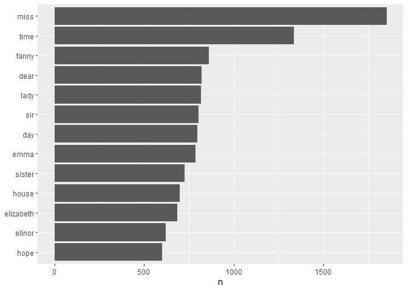
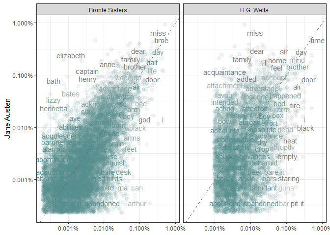

Tidy text format
================

``` r
pacman::p_load(
        rio,            # import and export files
        here,           # locate files 
        tidyverse,      # data management and visualization
        tidytext,
        janeaustenr,     # Jane Austen’s 6 completed, published novels
        gutenbergr
)
```

### Simple data

`tidytext::unnest_tokens()`

``` r
(text <- c("Because I could not stop for Death -",
          "He kindly stopped for me -",
          "The Carriage held but just Ourselves -",
          "and Immortality"))
```

    ## [1] "Because I could not stop for Death -"  
    ## [2] "He kindly stopped for me -"            
    ## [3] "The Carriage held but just Ourselves -"
    ## [4] "and Immortality"

``` r
(text_df <- tibble(line = 1:4,
                   text = text))
```

    ## # A tibble: 4 × 2
    ##    line text                                  
    ##   <int> <chr>                                 
    ## 1     1 Because I could not stop for Death -  
    ## 2     2 He kindly stopped for me -            
    ## 3     3 The Carriage held but just Ourselves -
    ## 4     4 and Immortality

``` r
text_df %>%
        unnest_tokens(output = word,
                      input = text)
```

    ## # A tibble: 20 × 2
    ##     line word       
    ##    <int> <chr>      
    ##  1     1 because    
    ##  2     1 i          
    ##  3     1 could      
    ##  4     1 not        
    ##  5     1 stop       
    ##  6     1 for        
    ##  7     1 death      
    ##  8     2 he         
    ##  9     2 kindly     
    ## 10     2 stopped    
    ## 11     2 for        
    ## 12     2 me         
    ## 13     3 the        
    ## 14     3 carriage   
    ## 15     3 held       
    ## 16     3 but        
    ## 17     3 just       
    ## 18     3 ourselves  
    ## 19     4 and        
    ## 20     4 immortality

### Jane Austen’s novels: `janeaustenr` package

``` r
# one-row-per-line format
austen_books()
```

    ## # A tibble: 73,422 × 2
    ##    text                    book               
    ##  * <chr>                   <fct>              
    ##  1 "SENSE AND SENSIBILITY" Sense & Sensibility
    ##  2 ""                      Sense & Sensibility
    ##  3 "by Jane Austen"        Sense & Sensibility
    ##  4 ""                      Sense & Sensibility
    ##  5 "(1811)"                Sense & Sensibility
    ##  6 ""                      Sense & Sensibility
    ##  7 ""                      Sense & Sensibility
    ##  8 ""                      Sense & Sensibility
    ##  9 ""                      Sense & Sensibility
    ## 10 "CHAPTER 1"             Sense & Sensibility
    ## # ℹ 73,412 more rows

``` r
(original_books <- austen_books() %>%
        group_by(book) %>%
        mutate(linenumber = row_number(),
               chapter = cumsum(str_detect(text, 
                                           regex("^chapter [\\divxlc]",
                                                 ignore_case = TRUE)))) %>%
        ungroup())
```

    ## # A tibble: 73,422 × 4
    ##    text                    book                linenumber chapter
    ##    <chr>                   <fct>                    <int>   <int>
    ##  1 "SENSE AND SENSIBILITY" Sense & Sensibility          1       0
    ##  2 ""                      Sense & Sensibility          2       0
    ##  3 "by Jane Austen"        Sense & Sensibility          3       0
    ##  4 ""                      Sense & Sensibility          4       0
    ##  5 "(1811)"                Sense & Sensibility          5       0
    ##  6 ""                      Sense & Sensibility          6       0
    ##  7 ""                      Sense & Sensibility          7       0
    ##  8 ""                      Sense & Sensibility          8       0
    ##  9 ""                      Sense & Sensibility          9       0
    ## 10 "CHAPTER 1"             Sense & Sensibility         10       1
    ## # ℹ 73,412 more rows

``` r
# unnest_tokens
(tidy_books <- original_books %>%
        unnest_tokens(output = word,
                      input = text))
```

    ## # A tibble: 725,055 × 4
    ##    book                linenumber chapter word       
    ##    <fct>                    <int>   <int> <chr>      
    ##  1 Sense & Sensibility          1       0 sense      
    ##  2 Sense & Sensibility          1       0 and        
    ##  3 Sense & Sensibility          1       0 sensibility
    ##  4 Sense & Sensibility          3       0 by         
    ##  5 Sense & Sensibility          3       0 jane       
    ##  6 Sense & Sensibility          3       0 austen     
    ##  7 Sense & Sensibility          5       0 1811       
    ##  8 Sense & Sensibility         10       1 chapter    
    ##  9 Sense & Sensibility         10       1 1          
    ## 10 Sense & Sensibility         13       1 the        
    ## # ℹ 725,045 more rows

``` r
# remove stopwords
(tidy_austen <- tidy_books %>%
        anti_join(stop_words))
```

    ## Joining with `by = join_by(word)`

    ## # A tibble: 217,609 × 4
    ##    book                linenumber chapter word       
    ##    <fct>                    <int>   <int> <chr>      
    ##  1 Sense & Sensibility          1       0 sense      
    ##  2 Sense & Sensibility          1       0 sensibility
    ##  3 Sense & Sensibility          3       0 jane       
    ##  4 Sense & Sensibility          3       0 austen     
    ##  5 Sense & Sensibility          5       0 1811       
    ##  6 Sense & Sensibility         10       1 chapter    
    ##  7 Sense & Sensibility         10       1 1          
    ##  8 Sense & Sensibility         13       1 family     
    ##  9 Sense & Sensibility         13       1 dashwood   
    ## 10 Sense & Sensibility         13       1 settled    
    ## # ℹ 217,599 more rows

``` r
# most common words in all books
tidy_austen %>%
        count(word, sort = TRUE)
```

    ## # A tibble: 13,914 × 2
    ##    word       n
    ##    <chr>  <int>
    ##  1 miss    1855
    ##  2 time    1337
    ##  3 fanny    862
    ##  4 dear     822
    ##  5 lady     817
    ##  6 sir      806
    ##  7 day      797
    ##  8 emma     787
    ##  9 sister   727
    ## 10 house    699
    ## # ℹ 13,904 more rows

``` r
# visualize the most common words
tidy_austen %>%
        count(word, sort = TRUE) %>%
        filter(n > 600) %>%
        mutate(word = reorder(word, n)) %>%
        ggplot(aes(n, word)) +
        geom_col() +
        labs(y = NULL)
```

<!-- -->

### `gutenbergr` package

Download novels by H.G. Wells: (35) The Time Machine, (36) The War of
the Worlds, (5230) The Invisible Man, (159) The Island of Doctor Moreau

``` r
#hgwells <- gutenberg_download(c(35, 36, 5230, 159))

hgwells
```

    ## # A tibble: 15,303 × 2
    ##    gutenberg_id text              
    ##           <int> <chr>             
    ##  1           35 "The Time Machine"
    ##  2           35 ""                
    ##  3           35 "An Invention"    
    ##  4           35 ""                
    ##  5           35 "by H. G. Wells"  
    ##  6           35 ""                
    ##  7           35 ""                
    ##  8           35 "CONTENTS"        
    ##  9           35 ""                
    ## 10           35 " I Introduction" 
    ## # ℹ 15,293 more rows

``` r
# tidying the data
(tidy_hgwells <- hgwells %>%
        unnest_tokens(output = word, input = text) %>%
        anti_join(stop_words))
```

    ## Joining with `by = join_by(word)`

    ## # A tibble: 52,313 × 2
    ##    gutenberg_id word        
    ##           <int> <chr>       
    ##  1           35 time        
    ##  2           35 machine     
    ##  3           35 invention   
    ##  4           35 contents    
    ##  5           35 introduction
    ##  6           35 ii          
    ##  7           35 machine     
    ##  8           35 iii         
    ##  9           35 time        
    ## 10           35 traveller   
    ## # ℹ 52,303 more rows

``` r
# most common words
tidy_hgwells %>%
        count(word, sort = TRUE)
```

    ## # A tibble: 10,320 × 2
    ##    word          n
    ##    <chr>     <int>
    ##  1 time        396
    ##  2 people      249
    ##  3 door        224
    ##  4 kemp        213
    ##  5 invisible   197
    ##  6 black       178
    ##  7 stood       174
    ##  8 night       168
    ##  9 heard       167
    ## 10 hall        165
    ## # ℹ 10,310 more rows

Download novels by the Brontë sisters: (1260) Jane Eyre, (768) Wuthering
Heights, (969) The Tenant of Wildfell Hall, (9182) Villette, (767) Agnes
Grey

``` r
#bronte <- gutenberg_download(c(1260, 768, 969, 9182, 767))

bronte
```

    ## # A tibble: 80,001 × 2
    ##    gutenberg_id text                              
    ##           <int> <chr>                             
    ##  1          767 "Agnes Grey"                      
    ##  2          767 "A NOVEL,"                        
    ##  3          767 ""                                
    ##  4          767 "by ACTON BELL."                  
    ##  5          767 ""                                
    ##  6          767 "LONDON:"                         
    ##  7          767 "THOMAS CAUTLEY NEWBY, PUBLISHER,"
    ##  8          767 "72, MORTIMER ST., CAVENDISH SQ." 
    ##  9          767 ""                                
    ## 10          767 "1847."                           
    ## # ℹ 79,991 more rows

``` r
# tidying the data
(tidy_bronte <- bronte %>%
        unnest_tokens(output = word, input = text) %>%
        anti_join(stop_words))
```

    ## Joining with `by = join_by(word)`

    ## # A tibble: 255,798 × 2
    ##    gutenberg_id word     
    ##           <int> <chr>    
    ##  1          767 agnes    
    ##  2          767 grey     
    ##  3          767 acton    
    ##  4          767 bell     
    ##  5          767 london   
    ##  6          767 thomas   
    ##  7          767 cautley  
    ##  8          767 newby    
    ##  9          767 publisher
    ## 10          767 72       
    ## # ℹ 255,788 more rows

``` r
# most common words
tidy_bronte %>%
        count(word, sort = TRUE)
```

    ## # A tibble: 23,213 × 2
    ##    word       n
    ##    <chr>  <int>
    ##  1 time    1065
    ##  2 miss     854
    ##  3 day      825
    ##  4 don’t    780
    ##  5 hand     767
    ##  6 eyes     714
    ##  7 night    648
    ##  8 heart    638
    ##  9 looked   601
    ## 10 door     591
    ## # ℹ 23,203 more rows

### Challenge

Calculate the frequency for each word for the works of Jane Austen, the
Brontë sisters, and H.G. Wells

``` r
(austen_df <- tidy_austen %>% 
        mutate(author = "Jane Austen") %>%
        select(author, word))
```

    ## # A tibble: 217,609 × 2
    ##    author      word       
    ##    <chr>       <chr>      
    ##  1 Jane Austen sense      
    ##  2 Jane Austen sensibility
    ##  3 Jane Austen jane       
    ##  4 Jane Austen austen     
    ##  5 Jane Austen 1811       
    ##  6 Jane Austen chapter    
    ##  7 Jane Austen 1          
    ##  8 Jane Austen family     
    ##  9 Jane Austen dashwood   
    ## 10 Jane Austen settled    
    ## # ℹ 217,599 more rows

``` r
(hgwells_df <- tidy_hgwells %>%
        mutate(author = "H.G. Wells") %>%
        select(author, word))
```

    ## # A tibble: 52,313 × 2
    ##    author     word        
    ##    <chr>      <chr>       
    ##  1 H.G. Wells time        
    ##  2 H.G. Wells machine     
    ##  3 H.G. Wells invention   
    ##  4 H.G. Wells contents    
    ##  5 H.G. Wells introduction
    ##  6 H.G. Wells ii          
    ##  7 H.G. Wells machine     
    ##  8 H.G. Wells iii         
    ##  9 H.G. Wells time        
    ## 10 H.G. Wells traveller   
    ## # ℹ 52,303 more rows

``` r
(bronte_df <- tidy_bronte %>%
        mutate(author = "Brontë Sisters") %>%
        select(author, word))
```

    ## # A tibble: 255,798 × 2
    ##    author         word     
    ##    <chr>          <chr>    
    ##  1 Brontë Sisters agnes    
    ##  2 Brontë Sisters grey     
    ##  3 Brontë Sisters acton    
    ##  4 Brontë Sisters bell     
    ##  5 Brontë Sisters london   
    ##  6 Brontë Sisters thomas   
    ##  7 Brontë Sisters cautley  
    ##  8 Brontë Sisters newby    
    ##  9 Brontë Sisters publisher
    ## 10 Brontë Sisters 72       
    ## # ℹ 255,788 more rows

``` r
(freq_df <- austen_df %>%
        full_join(hgwells_df) %>%
        full_join(bronte_df) %>%
        mutate(word = str_extract(word, "[a-z']+")) %>%
        count(author, word) %>%
        group_by(author) %>%
        mutate(proprtion = n/sum(n)) %>%
        select(-n) %>%
        pivot_wider(names_from = author,
                    values_from = proprtion))
```

    ## Joining with `by = join_by(author, word)`
    ## Joining with `by = join_by(author, word)`

    ## # A tibble: 27,763 × 4
    ##    word        `Brontë Sisters` `H.G. Wells` `Jane Austen`
    ##    <chr>                  <dbl>        <dbl>         <dbl>
    ##  1 a                 0.0000665     0.0000191    0.00000919
    ##  2 aback             0.00000391    0.0000191   NA         
    ##  3 abaht             0.00000391   NA           NA         
    ##  4 abandon           0.0000313     0.0000191   NA         
    ##  5 abandoned         0.0000899     0.000191     0.00000460
    ##  6 abandoning        0.00000391    0.0000382   NA         
    ##  7 abandonment       0.0000195     0.0000191   NA         
    ##  8 abase             0.00000391   NA           NA         
    ##  9 abasement         0.0000156    NA           NA         
    ## 10 abashed           0.0000156    NA            0.00000460
    ## # ℹ 27,753 more rows

Visualize

``` r
fig <- freq_df %>%
        pivot_longer(cols = c(`Brontë Sisters`, `H.G. Wells`),
                     names_to = "author",
                     values_to = "proportion") %>%
        ggplot(aes(y = `Jane Austen`,
                   x = proportion,
                   color = abs(`Jane Austen` - proportion))) +
        geom_jitter(alpha = 0.1, size = 2.5, width = 0.3, height = 0.3) +
        geom_abline(color = "gray40", lty = 2) +
        geom_text(aes(label = word), check_overlap = TRUE, vjust = 1.5) +
        facet_wrap(~ author) +
        scale_x_log10(labels = scales::percent_format()) +
        scale_y_log10(labels = scales::percent_format()) +
        scale_color_gradient(limits = c(0, 0.001), 
                             low = "darkslategray4", high = "gray75") +
        labs(x = NULL) +
        theme_bw() +
        theme(legend.position = "none")

fig
```

    ## Warning: Removed 39790 rows containing missing values or values outside the scale range
    ## (`geom_point()`).

    ## Warning: Removed 39792 rows containing missing values or values outside the scale range
    ## (`geom_text()`).

<!-- -->

How correlated are the word frequencies between Austen and the Brontë
sisters, and between Austen and Wells?

``` r
cor.test(freq_df$`Jane Austen`, freq_df$`Brontë Sisters`)
```

    ## 
    ##  Pearson's product-moment correlation
    ## 
    ## data:  freq_df$`Jane Austen` and freq_df$`Brontë Sisters`
    ## t = 110.73, df = 10275, p-value < 2.2e-16
    ## alternative hypothesis: true correlation is not equal to 0
    ## 95 percent confidence interval:
    ##  0.7286645 0.7462983
    ## sample estimates:
    ##       cor 
    ## 0.7376071

``` r
cor.test(freq_df$`Jane Austen`, freq_df$`H.G. Wells`)
```

    ## 
    ##  Pearson's product-moment correlation
    ## 
    ## data:  freq_df$`Jane Austen` and freq_df$`H.G. Wells`
    ## t = 33.563, df = 5457, p-value < 2.2e-16
    ## alternative hypothesis: true correlation is not equal to 0
    ## 95 percent confidence interval:
    ##  0.3914204 0.4354038
    ## sample estimates:
    ##       cor 
    ## 0.4136534

The word frequencies are more correlated between the Austen and Brontë
novels than between Austen and H.G. Wells.

``` r
# rmarkdown::render()
```
