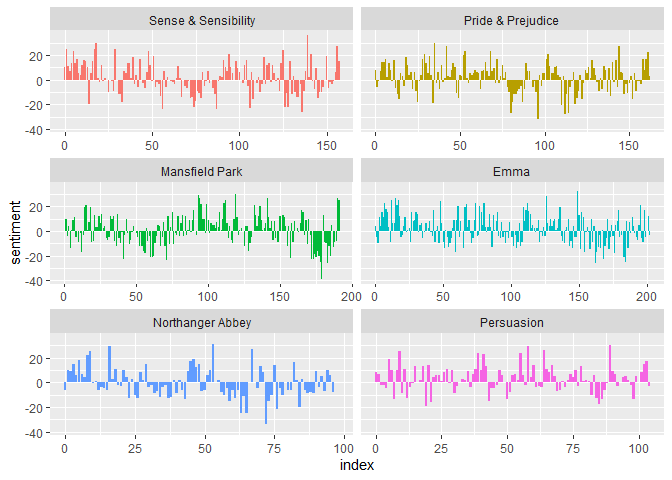
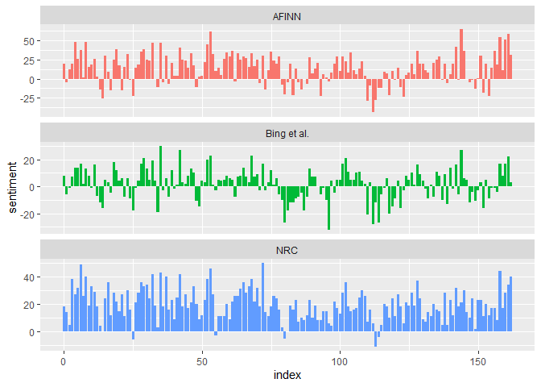
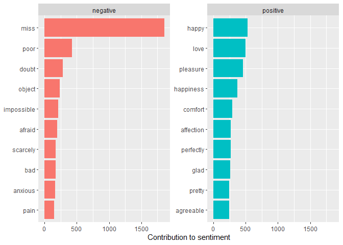
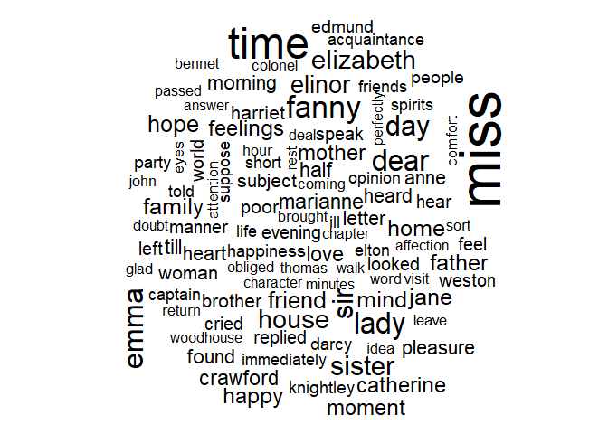
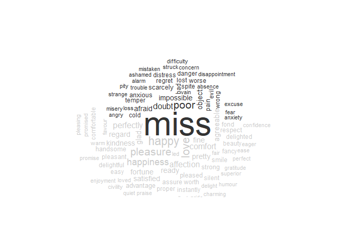

Sentiment analysis
================

``` r
pacman::p_load(
        rio,            # import and export files
        here,           # locate files 
        tidyverse,       # data management and visualization
        tidytext,
        textdata,
        wordcloud,
        reshape2,
        janeaustenr
)
```

## Sentiments dataset

``` r
(sentiment_afinn <- get_sentiments("afinn"))
```

    ## # A tibble: 2,477 × 2
    ##    word       value
    ##    <chr>      <dbl>
    ##  1 abandon       -2
    ##  2 abandoned     -2
    ##  3 abandons      -2
    ##  4 abducted      -2
    ##  5 abduction     -2
    ##  6 abductions    -2
    ##  7 abhor         -3
    ##  8 abhorred      -3
    ##  9 abhorrent     -3
    ## 10 abhors        -3
    ## # ℹ 2,467 more rows

``` r
(sentiment_bing <- get_sentiments("bing"))
```

    ## # A tibble: 6,786 × 2
    ##    word        sentiment
    ##    <chr>       <chr>    
    ##  1 2-faces     negative 
    ##  2 abnormal    negative 
    ##  3 abolish     negative 
    ##  4 abominable  negative 
    ##  5 abominably  negative 
    ##  6 abominate   negative 
    ##  7 abomination negative 
    ##  8 abort       negative 
    ##  9 aborted     negative 
    ## 10 aborts      negative 
    ## # ℹ 6,776 more rows

``` r
(sentiment_nrc <- get_sentiments("nrc"))
```

    ## # A tibble: 13,872 × 2
    ##    word        sentiment
    ##    <chr>       <chr>    
    ##  1 abacus      trust    
    ##  2 abandon     fear     
    ##  3 abandon     negative 
    ##  4 abandon     sadness  
    ##  5 abandoned   anger    
    ##  6 abandoned   fear     
    ##  7 abandoned   negative 
    ##  8 abandoned   sadness  
    ##  9 abandonment anger    
    ## 10 abandonment fear     
    ## # ℹ 13,862 more rows

## `inner_join()`

What are the most common joy words in Emma by Jane Austen?

``` r
(tidy_austen <- austen_books() %>%
        group_by(book) %>%
        mutate(linenumber = row_number(),
               chapter = cumsum(str_detect(text,
                                           regex("^chapter [\\divxlc]", 
                                                 ignore_case = TRUE)))) %>%
        ungroup() %>%
        unnest_tokens(output = word, input = text) %>%
        anti_join(stop_words))
```

    ## Joining with `by = join_by(word)`

    ## # A tibble: 217,609 × 4
    ##    book                linenumber chapter word       
    ##    <fct>                    <int>   <int> <chr>      
    ##  1 Sense & Sensibility          1       0 sense      
    ##  2 Sense & Sensibility          1       0 sensibility
    ##  3 Sense & Sensibility          3       0 jane       
    ##  4 Sense & Sensibility          3       0 austen     
    ##  5 Sense & Sensibility          5       0 1811       
    ##  6 Sense & Sensibility         10       1 chapter    
    ##  7 Sense & Sensibility         10       1 1          
    ##  8 Sense & Sensibility         13       1 family     
    ##  9 Sense & Sensibility         13       1 dashwood   
    ## 10 Sense & Sensibility         13       1 settled    
    ## # ℹ 217,599 more rows

``` r
nrc_joy <- sentiment_nrc %>%
        filter(sentiment == "joy")

nrc_joy
```

    ## # A tibble: 687 × 2
    ##    word          sentiment
    ##    <chr>         <chr>    
    ##  1 absolution    joy      
    ##  2 abundance     joy      
    ##  3 abundant      joy      
    ##  4 accolade      joy      
    ##  5 accompaniment joy      
    ##  6 accomplish    joy      
    ##  7 accomplished  joy      
    ##  8 achieve       joy      
    ##  9 achievement   joy      
    ## 10 acrobat       joy      
    ## # ℹ 677 more rows

``` r
tidy_austen %>%
        count(book)
```

    ## # A tibble: 6 × 2
    ##   book                    n
    ##   <fct>               <int>
    ## 1 Sense & Sensibility 36330
    ## 2 Pride & Prejudice   37246
    ## 3 Mansfield Park      47968
    ## 4 Emma                46775
    ## 5 Northanger Abbey    23802
    ## 6 Persuasion          25488

``` r
tidy_austen %>%
        filter(book == "Emma") %>%
        inner_join(nrc_joy)
```

    ## Joining with `by = join_by(word)`

    ## # A tibble: 3,691 × 5
    ##    book  linenumber chapter word      sentiment
    ##    <fct>      <int>   <int> <chr>     <chr>    
    ##  1 Emma          16       1 happy     joy      
    ##  2 Emma          16       1 blessings joy      
    ##  3 Emma          21       1 marriage  joy      
    ##  4 Emma          22       1 mother    joy      
    ##  5 Emma          24       1 excellent joy      
    ##  6 Emma          25       1 mother    joy      
    ##  7 Emma          25       1 affection joy      
    ##  8 Emma          28       1 friend    joy      
    ##  9 Emma          33       1 friend    joy      
    ## 10 Emma          33       1 friend    joy      
    ## # ℹ 3,681 more rows

``` r
tidy_austen %>%
        filter(book == "Emma") %>%
        inner_join(nrc_joy) %>%
        count(word, sort = TRUE)
```

    ## Joining with `by = join_by(word)`

    ## # A tibble: 297 × 2
    ##    word          n
    ##    <chr>     <int>
    ##  1 friend      166
    ##  2 hope        143
    ##  3 happy       125
    ##  4 love        117
    ##  5 deal         92
    ##  6 found        92
    ##  7 happiness    76
    ##  8 pretty       68
    ##  9 true         66
    ## 10 comfort      65
    ## # ℹ 287 more rows

How sentiment changes throughout each novel?

``` r
tidy_austen %>%
        inner_join(sentiment_bing) %>%
        mutate(index = linenumber %/% 80) %>%
        count(book, index, sentiment)
```

    ## Joining with `by = join_by(word)`

    ## Warning in inner_join(., sentiment_bing): Detected an unexpected many-to-many relationship between `x` and `y`.
    ## ℹ Row 131015 of `x` matches multiple rows in `y`.
    ## ℹ Row 5051 of `y` matches multiple rows in `x`.
    ## ℹ If a many-to-many relationship is expected, set `relationship = "many-to-many"` to silence this warning.

    ## # A tibble: 1,840 × 4
    ##    book                index sentiment     n
    ##    <fct>               <dbl> <chr>     <int>
    ##  1 Sense & Sensibility     0 negative     16
    ##  2 Sense & Sensibility     0 positive     26
    ##  3 Sense & Sensibility     1 negative     19
    ##  4 Sense & Sensibility     1 positive     44
    ##  5 Sense & Sensibility     2 negative     12
    ##  6 Sense & Sensibility     2 positive     23
    ##  7 Sense & Sensibility     3 negative     15
    ##  8 Sense & Sensibility     3 positive     22
    ##  9 Sense & Sensibility     4 negative     16
    ## 10 Sense & Sensibility     4 positive     29
    ## # ℹ 1,830 more rows

``` r
(sentiment_austen <- tidy_austen %>%
        inner_join(sentiment_bing) %>%
        mutate(index = linenumber %/% 80) %>%
        count(book, index, sentiment) %>%
        pivot_wider(names_from = sentiment,
                    values_from = n,
                    values_fill = 0) %>%
        mutate(sentiment = positive - negative))
```

    ## Joining with `by = join_by(word)`

    ## Warning in inner_join(., sentiment_bing): Detected an unexpected many-to-many relationship between `x` and `y`.
    ## ℹ Row 131015 of `x` matches multiple rows in `y`.
    ## ℹ Row 5051 of `y` matches multiple rows in `x`.
    ## ℹ If a many-to-many relationship is expected, set `relationship = "many-to-many"` to silence this warning.

    ## # A tibble: 920 × 5
    ##    book                index negative positive sentiment
    ##    <fct>               <dbl>    <int>    <int>     <int>
    ##  1 Sense & Sensibility     0       16       26        10
    ##  2 Sense & Sensibility     1       19       44        25
    ##  3 Sense & Sensibility     2       12       23        11
    ##  4 Sense & Sensibility     3       15       22         7
    ##  5 Sense & Sensibility     4       16       29        13
    ##  6 Sense & Sensibility     5       16       39        23
    ##  7 Sense & Sensibility     6       24       37        13
    ##  8 Sense & Sensibility     7       22       39        17
    ##  9 Sense & Sensibility     8       30       35         5
    ## 10 Sense & Sensibility     9       14       18         4
    ## # ℹ 910 more rows

``` r
sentiment_austen %>%
        ggplot(aes(x = index,
                   y = sentiment,
                   fill = book)) +
        geom_col(show.legend = FALSE) +
        facet_wrap(~book, ncol = 2, scales = "free_x")
```

<!-- -->

## Compare three sentiment dictionaries

Pride and Prejudice by Jane Austen

``` r
(pride_prejudice <- tidy_austen %>% 
        filter(book == "Pride & Prejudice"))
```

    ## # A tibble: 37,246 × 4
    ##    book              linenumber chapter word        
    ##    <fct>                  <int>   <int> <chr>       
    ##  1 Pride & Prejudice          1       0 pride       
    ##  2 Pride & Prejudice          1       0 prejudice   
    ##  3 Pride & Prejudice          3       0 jane        
    ##  4 Pride & Prejudice          3       0 austen      
    ##  5 Pride & Prejudice          7       1 chapter     
    ##  6 Pride & Prejudice          7       1 1           
    ##  7 Pride & Prejudice         10       1 truth       
    ##  8 Pride & Prejudice         10       1 universally 
    ##  9 Pride & Prejudice         10       1 acknowledged
    ## 10 Pride & Prejudice         10       1 single      
    ## # ℹ 37,236 more rows

``` r
(afinn <- pride_prejudice %>% 
        inner_join(sentiment_afinn) %>% 
        group_by(index = linenumber %/% 80) %>% 
        summarise(sentiment = sum(value)) %>% 
        mutate(method = "AFINN"))
```

    ## Joining with `by = join_by(word)`

    ## # A tibble: 163 × 3
    ##    index sentiment method
    ##    <dbl>     <dbl> <chr> 
    ##  1     0        20 AFINN 
    ##  2     1        -5 AFINN 
    ##  3     2        12 AFINN 
    ##  4     3        20 AFINN 
    ##  5     4        48 AFINN 
    ##  6     5        26 AFINN 
    ##  7     6        37 AFINN 
    ##  8     7         2 AFINN 
    ##  9     8        48 AFINN 
    ## 10     9        15 AFINN 
    ## # ℹ 153 more rows

``` r
(bing <- pride_prejudice %>%
        inner_join(sentiment_bing) %>%
        mutate(method = "Bing et al.",
               index = linenumber %/% 80))
```

    ## Joining with `by = join_by(word)`

    ## # A tibble: 7,521 × 7
    ##    book              linenumber chapter word        sentiment method      index
    ##    <fct>                  <int>   <int> <chr>       <chr>     <chr>       <dbl>
    ##  1 Pride & Prejudice          1       0 pride       positive  Bing et al.     0
    ##  2 Pride & Prejudice          1       0 prejudice   negative  Bing et al.     0
    ##  3 Pride & Prejudice         11       1 fortune     positive  Bing et al.     0
    ##  4 Pride & Prejudice         15       1 rightful    positive  Bing et al.     0
    ##  5 Pride & Prejudice         28       1 impatiently negative  Bing et al.     0
    ##  6 Pride & Prejudice         30       1 objection   negative  Bing et al.     0
    ##  7 Pride & Prejudice         35       1 fortune     positive  Bing et al.     0
    ##  8 Pride & Prejudice         37       1 delighted   positive  Bing et al.     0
    ##  9 Pride & Prejudice         47       1 fortune     positive  Bing et al.     0
    ## 10 Pride & Prejudice         48       1 fine        positive  Bing et al.     0
    ## # ℹ 7,511 more rows

``` r
(nrc <- pride_prejudice %>%
        inner_join(sentiment_nrc) %>%
        mutate(method = "NRC",
               index = linenumber %/% 80) %>%
        filter(sentiment %in% c("positive", "negative")))
```

    ## Joining with `by = join_by(word)`

    ## Warning in inner_join(., sentiment_nrc): Detected an unexpected many-to-many relationship between `x` and `y`.
    ## ℹ Row 1 of `x` matches multiple rows in `y`.
    ## ℹ Row 12737 of `y` matches multiple rows in `x`.
    ## ℹ If a many-to-many relationship is expected, set `relationship = "many-to-many"` to silence this warning.

    ## # A tibble: 10,337 × 7
    ##    book              linenumber chapter word       sentiment method index
    ##    <fct>                  <int>   <int> <chr>      <chr>     <chr>  <dbl>
    ##  1 Pride & Prejudice          1       0 pride      positive  NRC        0
    ##  2 Pride & Prejudice          1       0 prejudice  negative  NRC        0
    ##  3 Pride & Prejudice         10       1 truth      positive  NRC        0
    ##  4 Pride & Prejudice         10       1 possession negative  NRC        0
    ##  5 Pride & Prejudice         11       1 fortune    positive  NRC        0
    ##  6 Pride & Prejudice         14       1 truth      positive  NRC        0
    ##  7 Pride & Prejudice         15       1 rightful   positive  NRC        0
    ##  8 Pride & Prejudice         18       1 dear       positive  NRC        0
    ##  9 Pride & Prejudice         30       1 objection  negative  NRC        0
    ## 10 Pride & Prejudice         30       1 hearing    negative  NRC        0
    ## # ℹ 10,327 more rows

``` r
(bing_nrc <- bing %>% 
        full_join(nrc) %>%
        count(method, index, sentiment) %>%
        pivot_wider(names_from = sentiment,
                    values_from = n,
                    values_fill = 0) %>%
        mutate(sentiment = positive - negative))
```

    ## Joining with `by = join_by(book, linenumber, chapter, word, sentiment, method, index)`

    ## # A tibble: 326 × 5
    ##    method      index negative positive sentiment
    ##    <chr>       <dbl>    <int>    <int>     <int>
    ##  1 Bing et al.     0        7       15         8
    ##  2 Bing et al.     1       20       14        -6
    ##  3 Bing et al.     2       15       14        -1
    ##  4 Bing et al.     3       19       26         7
    ##  5 Bing et al.     4       23       37        14
    ##  6 Bing et al.     5       15       29        14
    ##  7 Bing et al.     6       18       35        17
    ##  8 Bing et al.     7       23       25         2
    ##  9 Bing et al.     8       17       30        13
    ## 10 Bing et al.     9       22       30         8
    ## # ℹ 316 more rows

``` r
bing_nrc %>%
        select(index, sentiment, method) %>%
        full_join(afinn) %>%
        ggplot(aes(x = index,
                   y = sentiment,
                   fill = method)) +
        geom_col(show.legend = FALSE) +
        facet_wrap(~method, ncol = 1, scales = "free_y")
```

    ## Joining with `by = join_by(index, sentiment, method)`

<!-- -->

NRC sentiment is high. AFINN sentiment has more variance. Bing et
al. sentiment appears to find longer stretches of similar text. but all
three agree roughly on the overall trends in the sentiment through a
narrative arc.

``` r
###
```

## Most common positive and negative words

``` r
tidy_austen %>%
        inner_join(sentiment_bing) %>%
        count(word, sentiment, sort = TRUE) %>%
        group_by(sentiment) %>%
        slice_max(n, n = 10) %>%
        ungroup() %>%
        ggplot(aes(x = n,
                   y = reorder(word, n),
                   fill = sentiment)) +
        geom_col(show.legend = FALSE) +
        facet_wrap(~sentiment, scales = "free_y") +
        labs(x = "Contribution to sentiment",
             y = NULL)
```

    ## Joining with `by = join_by(word)`

    ## Warning in inner_join(., sentiment_bing): Detected an unexpected many-to-many relationship between `x` and `y`.
    ## ℹ Row 131015 of `x` matches multiple rows in `y`.
    ## ℹ Row 5051 of `y` matches multiple rows in `x`.
    ## ℹ If a many-to-many relationship is expected, set `relationship = "many-to-many"` to silence this warning.

<!-- -->

## Wordclouds

``` r
tidy_austen %>%
        count(word) %>%
        with(wordcloud(word, n, max.words = 100))
```

<!-- -->

``` r
tidy_austen %>%
        inner_join(sentiment_bing) %>%
        count(word, sentiment, sort = TRUE) %>%
        reshape2::acast(word ~ sentiment,
                        value.var = "n",
                        fill = 0) %>%
        comparison.cloud(colors = c("gray20", "gray80"),
                         max.words = 100)
```

    ## Joining with `by = join_by(word)`

    ## Warning in inner_join(., sentiment_bing): Detected an unexpected many-to-many relationship between `x` and `y`.
    ## ℹ Row 131015 of `x` matches multiple rows in `y`.
    ## ℹ Row 5051 of `y` matches multiple rows in `x`.
    ## ℹ If a many-to-many relationship is expected, set `relationship = "many-to-many"` to silence this warning.

<!-- -->

Units beyond just words

``` r
(austen_chapters <- austen_books() %>%
        group_by(book) %>%
        unnest_tokens(chapter,
                      text,
                      token = "regex", 
                      pattern = "Chapter|CHAPTER [\\dIVXLC]") %>%
        ungroup())
```

    ## # A tibble: 275 × 2
    ##    book                chapter                                                                                                                      
    ##    <fct>               <chr>                                                                                                                        
    ##  1 Sense & Sensibility "sense and sensibility\n\nby jane austen\n\n(1811)\n\n\n\n\n"                                                                
    ##  2 Sense & Sensibility "\n\n\nthe family of dashwood had long been settled in sussex.  their estate\nwas large, and their residence was at norland …
    ##  3 Sense & Sensibility "\n\n\nmrs. john dashwood now installed herself mistress of norland; and her\nmother and sisters-in-law were degraded to the…
    ##  4 Sense & Sensibility "\n\n\nmrs. dashwood remained at norland several months; not from any\ndisinclination to move when the sight of every well k…
    ##  5 Sense & Sensibility "\n\n\n\"what a pity it is, elinor,\" said marianne, \"that edward should have no\ntaste for drawing.\"\n\n\"no taste for dr…
    ##  6 Sense & Sensibility "\n\n\nno sooner was her answer dispatched, than mrs. dashwood indulged herself\nin the pleasure of announcing to her son-in…
    ##  7 Sense & Sensibility "\n\n\nthe first part of their journey was performed in too melancholy a\ndisposition to be otherwise than tedious and unple…
    ##  8 Sense & Sensibility "\n\n\nbarton park was about half a mile from the cottage.  the ladies had\npassed near it in their way along the valley, bu…
    ##  9 Sense & Sensibility "\n\n\nmrs. jennings was a widow with an ample jointure.  she had only two\ndaughters, both of whom she had lived to see res…
    ## 10 Sense & Sensibility "\n\n\nthe dashwoods were now settled at barton with tolerable comfort to\nthemselves.  the house and the garden, with all t…
    ## # ℹ 265 more rows

``` r
austen_chapters %>% 
        group_by(book) %>% 
        summarise(chapters = n())
```

    ## # A tibble: 6 × 2
    ##   book                chapters
    ##   <fct>                  <int>
    ## 1 Sense & Sensibility       51
    ## 2 Pride & Prejudice         62
    ## 3 Mansfield Park            49
    ## 4 Emma                      56
    ## 5 Northanger Abbey          32
    ## 6 Persuasion                25

What are the most negative chapters in each of Jane Austen’s novels?

``` r
(bing_negative <- sentiment_bing %>%
        filter(sentiment == "negative"))
```

    ## # A tibble: 4,781 × 2
    ##    word        sentiment
    ##    <chr>       <chr>    
    ##  1 2-faces     negative 
    ##  2 abnormal    negative 
    ##  3 abolish     negative 
    ##  4 abominable  negative 
    ##  5 abominably  negative 
    ##  6 abominate   negative 
    ##  7 abomination negative 
    ##  8 abort       negative 
    ##  9 aborted     negative 
    ## 10 aborts      negative 
    ## # ℹ 4,771 more rows

``` r
(word_count <- tidy_austen %>%
        group_by(book, chapter) %>%
        summarise(words = n()))
```

    ## `summarise()` has grouped output by 'book'. You can override using the `.groups` argument.

    ## # A tibble: 275 × 3
    ## # Groups:   book [6]
    ##    book                chapter words
    ##    <fct>                 <int> <int>
    ##  1 Sense & Sensibility       0     5
    ##  2 Sense & Sensibility       1   533
    ##  3 Sense & Sensibility       2   498
    ##  4 Sense & Sensibility       3   505
    ##  5 Sense & Sensibility       4   591
    ##  6 Sense & Sensibility       5   339
    ##  7 Sense & Sensibility       6   426
    ##  8 Sense & Sensibility       7   456
    ##  9 Sense & Sensibility       8   377
    ## 10 Sense & Sensibility       9   620
    ## # ℹ 265 more rows

``` r
tidy_austen %>%
        semi_join(bing_negative) %>%
        group_by(book, chapter) %>%
        summarise(negative_words = n()) %>%
        left_join(word_count,
                  by = c("book", "chapter")) %>%
        mutate(ratio = negative_words/words) %>%
        filter(chapter != 0) %>%
        slice_max(ratio, n = 1) %>%
        ungroup()
```

    ## Joining with `by = join_by(word)`
    ## `summarise()` has grouped output by 'book'. You can override using the `.groups` argument.

    ## # A tibble: 6 × 5
    ##   book                chapter negative_words words ratio
    ##   <fct>                 <int>          <int> <int> <dbl>
    ## 1 Sense & Sensibility      29            172  1135 0.152
    ## 2 Pride & Prejudice        34            108   646 0.167
    ## 3 Mansfield Park           45            132   884 0.149
    ## 4 Emma                     15            147  1012 0.145
    ## 5 Northanger Abbey         27             55   337 0.163
    ## 6 Persuasion               21            215  1948 0.110

``` r
# rmarkdown::render()
```
