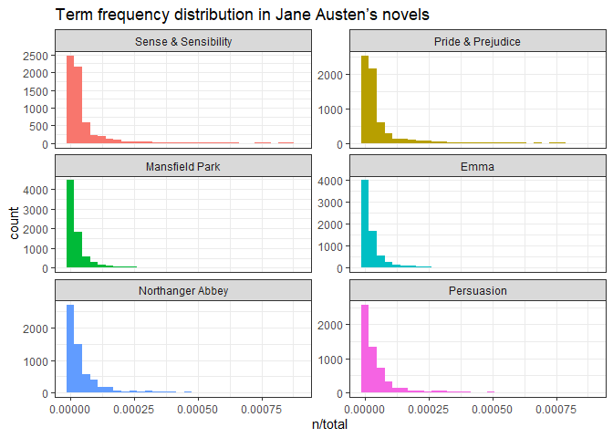
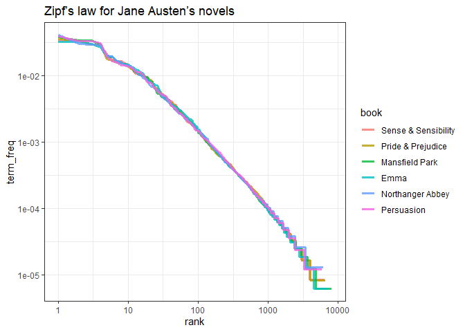
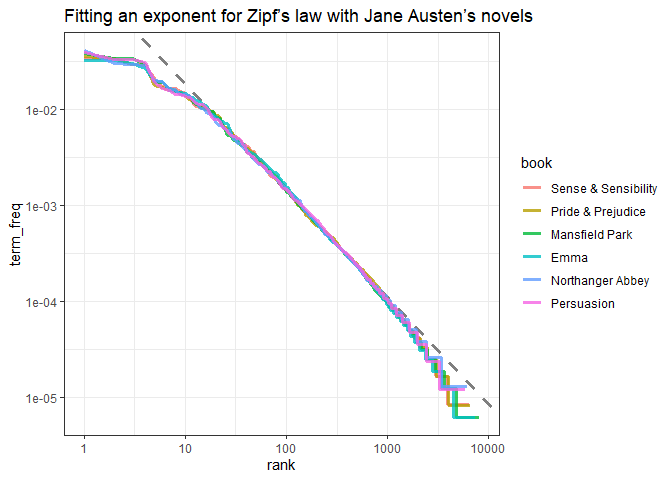
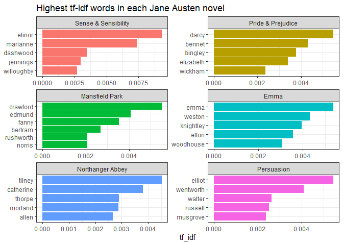
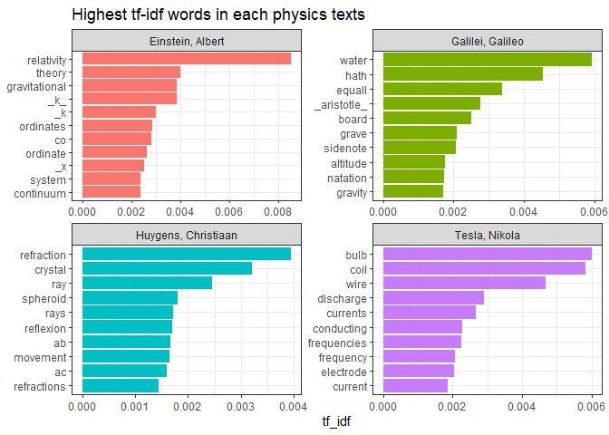
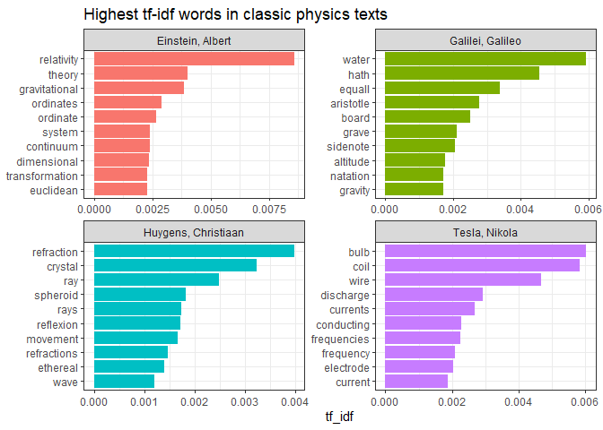

tf-idf
================

``` r
pacman::p_load(
        tidyverse,      # data management and visualization
        tidytext,
        janeaustenr,
        gutenbergr
)
```

## Term frequency in Jane Austen’s novels

``` r
(book_words <- austen_books() %>%
        unnest_tokens(word, text) %>%
        count(book, word, sort = TRUE))
```

    ## # A tibble: 40,379 × 3
    ##    book              word      n
    ##    <fct>             <chr> <int>
    ##  1 Mansfield Park    the    6206
    ##  2 Mansfield Park    to     5475
    ##  3 Mansfield Park    and    5438
    ##  4 Emma              to     5239
    ##  5 Emma              the    5201
    ##  6 Emma              and    4896
    ##  7 Mansfield Park    of     4778
    ##  8 Pride & Prejudice the    4331
    ##  9 Emma              of     4291
    ## 10 Pride & Prejudice to     4162
    ## # ℹ 40,369 more rows

``` r
(total_words <- book_words %>%
        group_by(book) %>%
        summarise(total = sum(n)))
```

    ## # A tibble: 6 × 2
    ##   book                 total
    ##   <fct>                <int>
    ## 1 Sense & Sensibility 119957
    ## 2 Pride & Prejudice   122204
    ## 3 Mansfield Park      160460
    ## 4 Emma                160996
    ## 5 Northanger Abbey     77780
    ## 6 Persuasion           83658

``` r
book_words %>%
        left_join(total_words)
```

    ## Joining with `by = join_by(book)`

    ## # A tibble: 40,379 × 4
    ##    book              word      n  total
    ##    <fct>             <chr> <int>  <int>
    ##  1 Mansfield Park    the    6206 160460
    ##  2 Mansfield Park    to     5475 160460
    ##  3 Mansfield Park    and    5438 160460
    ##  4 Emma              to     5239 160996
    ##  5 Emma              the    5201 160996
    ##  6 Emma              and    4896 160996
    ##  7 Mansfield Park    of     4778 160460
    ##  8 Pride & Prejudice the    4331 122204
    ##  9 Emma              of     4291 160996
    ## 10 Pride & Prejudice to     4162 122204
    ## # ℹ 40,369 more rows

Visualize distribution of `n/total` (= `term frequency` = number of
times a word appears in a novel divided by the total number of terms in
that novel) for each novel.

``` r
book_words %>%
        left_join(total_words) %>%
        ggplot(aes(n/total,
                   fill = book)) +
        geom_histogram(show.legend = FALSE) +
        xlim(NA, 0.0009) +
        facet_wrap(~book, ncol = 2, scales = "free_y") +
        labs(title = "Term frequency distribution in Jane Austen’s novels") +
        theme_bw()
```

    ## Joining with `by = join_by(book)`
    ## `stat_bin()` using `bins = 30`. Pick better value with `binwidth`.

    ## Warning: Removed 896 rows containing non-finite outside the scale range (`stat_bin()`).

    ## Warning: Removed 6 rows containing missing values or values outside the scale range (`geom_bar()`).

<!-- -->

=\> similar distributions for all the novels: many words occur rarely,
fewer words occur frequently.

## Zipf’s law

``` r
(freq_by_rank <- book_words %>%
        left_join(total_words) %>%
        group_by(book) %>%
        mutate(rank = row_number(),
               term_freq = n/total) %>%
        ungroup())
```

    ## Joining with `by = join_by(book)`

    ## # A tibble: 40,379 × 6
    ##    book              word      n  total  rank term_freq
    ##    <fct>             <chr> <int>  <int> <int>     <dbl>
    ##  1 Mansfield Park    the    6206 160460     1    0.0387
    ##  2 Mansfield Park    to     5475 160460     2    0.0341
    ##  3 Mansfield Park    and    5438 160460     3    0.0339
    ##  4 Emma              to     5239 160996     1    0.0325
    ##  5 Emma              the    5201 160996     2    0.0323
    ##  6 Emma              and    4896 160996     3    0.0304
    ##  7 Mansfield Park    of     4778 160460     4    0.0298
    ##  8 Pride & Prejudice the    4331 122204     1    0.0354
    ##  9 Emma              of     4291 160996     4    0.0267
    ## 10 Pride & Prejudice to     4162 122204     2    0.0341
    ## # ℹ 40,369 more rows

Visualize Zipf’s law

``` r
freq_by_rank %>%
        ggplot(aes(x = rank,
                   y = term_freq,
                   color = book)) +
        geom_line(linewidth = 1.1,
                  alpha = 0.8) +
        scale_x_log10() +
        scale_y_log10() +
        labs(title = "Zipf’s law for Jane Austen’s novels") +
        theme_bw()
```

<!-- -->

Fitting model

``` r
# slope close to -1
freq_by_rank %>% 
        filter(rank < 500,
               rank > 10) %>%
        lm(log10(.$term_freq) ~ log10(.$rank),
           data = .)
```

    ## 
    ## Call:
    ## lm(formula = log10(.$term_freq) ~ log10(.$rank), data = .)
    ## 
    ## Coefficients:
    ##   (Intercept)  log10(.$rank)  
    ##       -0.6226        -1.1125

``` r
freq_by_rank %>%
        ggplot(aes(x = rank,
                   y = term_freq,
                   color = book)) +
        geom_abline(intercept = -0.6226,
                    slope = -1.1125,
                    color = "gray50",
                    linetype = 2,
                    linewidth = 1.1) +
        geom_line(linewidth = 1.1,
                  alpha = 0.8) +
        scale_x_log10() +
        scale_y_log10() +
        labs(title = "Fitting an exponent for Zipf’s law with Jane Austen’s novels") +
        theme_bw()
```

<!-- -->

## `tidytext::bind_tf_idf()`

``` r
book_words %>%
        bind_tf_idf(term = word,
                    document = book,
                    n = n)
```

    ## # A tibble: 40,379 × 6
    ##    book              word      n     tf   idf tf_idf
    ##    <fct>             <chr> <int>  <dbl> <dbl>  <dbl>
    ##  1 Mansfield Park    the    6206 0.0387     0      0
    ##  2 Mansfield Park    to     5475 0.0341     0      0
    ##  3 Mansfield Park    and    5438 0.0339     0      0
    ##  4 Emma              to     5239 0.0325     0      0
    ##  5 Emma              the    5201 0.0323     0      0
    ##  6 Emma              and    4896 0.0304     0      0
    ##  7 Mansfield Park    of     4778 0.0298     0      0
    ##  8 Pride & Prejudice the    4331 0.0354     0      0
    ##  9 Emma              of     4291 0.0267     0      0
    ## 10 Pride & Prejudice to     4162 0.0341     0      0
    ## # ℹ 40,369 more rows

=\> zero for extremely common words

``` r
book_words %>%
        bind_tf_idf(term = word,
                    document = book,
                    n = n) %>%
        arrange(desc(tf_idf))
```

    ## # A tibble: 40,379 × 6
    ##    book                word          n      tf   idf  tf_idf
    ##    <fct>               <chr>     <int>   <dbl> <dbl>   <dbl>
    ##  1 Sense & Sensibility elinor      623 0.00519  1.79 0.00931
    ##  2 Sense & Sensibility marianne    492 0.00410  1.79 0.00735
    ##  3 Mansfield Park      crawford    493 0.00307  1.79 0.00551
    ##  4 Pride & Prejudice   darcy       373 0.00305  1.79 0.00547
    ##  5 Persuasion          elliot      254 0.00304  1.79 0.00544
    ##  6 Emma                emma        786 0.00488  1.10 0.00536
    ##  7 Northanger Abbey    tilney      196 0.00252  1.79 0.00452
    ##  8 Emma                weston      389 0.00242  1.79 0.00433
    ##  9 Pride & Prejudice   bennet      294 0.00241  1.79 0.00431
    ## 10 Persuasion          wentworth   191 0.00228  1.79 0.00409
    ## # ℹ 40,369 more rows

Visualize high tf-idf words

``` r
book_words %>%
        bind_tf_idf(term = word,
                    document = book,
                    n = n) %>%
        group_by(book) %>%
        slice_max(tf_idf, n = 5) %>%
        ungroup() %>%
        ggplot(aes(x = tf_idf,
                   y = fct_reorder(word, tf_idf),
                   fill = book)) +
        geom_col(show.legend = FALSE) +
        facet_wrap(~book, ncol = 2, scales = "free") +
        labs(y = NULL,
             title = "Highest tf-idf words in each Jane Austen novel") +
        theme_bw()
```

<!-- -->

## A corpus of physics texts

Physics books from Project Gutenberg: (37729) Discourse on Floating
Bodies by Galileo Galilei, (14725) Treatise on Light by Christiaan
Huygens, (13476) Experiments with Alternate Currents of High Potential
and High Frequency by Nikola Tesla, (30155) Relativity: The Special and
General Theory by Albert Einstein

``` r
physics <- gutenberg_download(c(37729, 14725, 13476, 30155), 
                              meta_fields = "author")

(physics_words <- physics %>%
        unnest_tokens(word, text) %>%
        count(author, word, sort = TRUE))
```

    ## # A tibble: 12,668 × 3
    ##    author              word      n
    ##    <chr>               <chr> <int>
    ##  1 Galilei, Galileo    the    3760
    ##  2 Tesla, Nikola       the    3604
    ##  3 Huygens, Christiaan the    3553
    ##  4 Einstein, Albert    the    2993
    ##  5 Galilei, Galileo    of     2049
    ##  6 Einstein, Albert    of     2029
    ##  7 Tesla, Nikola       of     1737
    ##  8 Huygens, Christiaan of     1708
    ##  9 Huygens, Christiaan to     1207
    ## 10 Tesla, Nikola       a      1176
    ## # ℹ 12,658 more rows

Calculate tf-idf

``` r
(physics_total <- physics_words %>%
        group_by(author) %>%
        summarise(total = sum(n)))
```

    ## # A tibble: 4 × 2
    ##   author              total
    ##   <chr>               <int>
    ## 1 Einstein, Albert    31451
    ## 2 Galilei, Galileo    40196
    ## 3 Huygens, Christiaan 38286
    ## 4 Tesla, Nikola       39495

``` r
physics_words %>%
        bind_tf_idf(term = word,
                    document = author,
                    n = n) %>%
        group_by(author) %>%
        slice_max(tf_idf, n = 10) %>%
        ungroup() %>%
        ggplot(aes(x = tf_idf,
                   y = fct_reorder(word, tf_idf),
                   fill = author)) +
        geom_col(show.legend = FALSE) +
        facet_wrap(~author, ncol = 2, scales = "free") +
        labs(y = NULL,
             title = "Highest tf-idf words in each physics texts") +
        theme_bw()
```

<!-- -->

Remove less meaningful words

``` r
my_stopwords <- tibble(word = c("eq", "co", "rc", "ac", "ak", "bn", 
                               "fig", "file", "cg", "cb", "cm",
                               "ab", "_k", "_k_", "_x"))

physics_words %>%
        anti_join(my_stopwords,
                  by = "word") %>%
        bind_tf_idf(term = word,
                    document = author,
                    n = n) %>%
        mutate(word = str_remove_all(word, "_")) %>%
        group_by(author) %>%
        slice_max(tf_idf, n = 10) %>%
        ungroup() %>%
        ggplot(aes(x = tf_idf,
                   y = fct_reorder(word, tf_idf),
                   fill = author)) +
        geom_col(show.legend = FALSE) +
        facet_wrap(~author, ncol = 2, scales = "free") +
        labs(y = NULL,
             title = "Highest tf-idf words in classic physics texts") +
        theme_bw()
```

<!-- -->

``` r
# rmarkdown::render()
```
