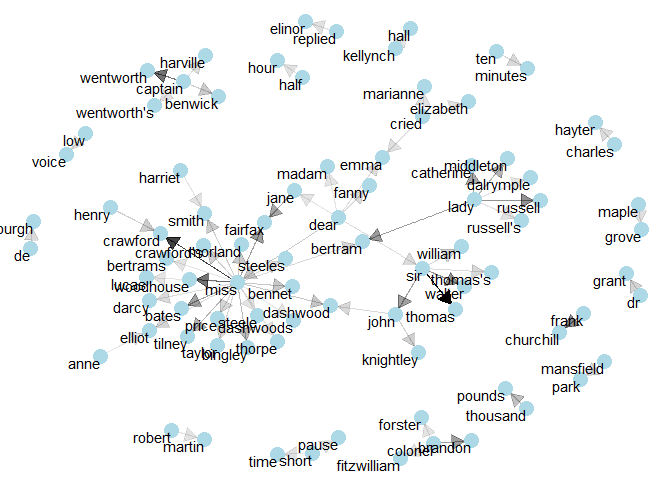

n-grams and correlations
================

``` r
pacman::p_load(
        rio,            # import and export files
        here,           # locate files 
        tidyverse,      # data management and visualization
        tidytext,
        ggraph,         # network plots
        igraph,
        widyr,          # calculates pairwise correlations
        janeaustenr
)
```

## Tokenizing by n-gram

``` r
austen_books() %>%
        unnest_tokens(output = bigram,
                      input = text,
                      token = "ngrams",
                      n = 2)
```

    ## # A tibble: 675,025 × 2
    ##    book                bigram         
    ##    <fct>               <chr>          
    ##  1 Sense & Sensibility sense and      
    ##  2 Sense & Sensibility and sensibility
    ##  3 Sense & Sensibility <NA>           
    ##  4 Sense & Sensibility by jane        
    ##  5 Sense & Sensibility jane austen    
    ##  6 Sense & Sensibility <NA>           
    ##  7 Sense & Sensibility <NA>           
    ##  8 Sense & Sensibility <NA>           
    ##  9 Sense & Sensibility <NA>           
    ## 10 Sense & Sensibility <NA>           
    ## # ℹ 675,015 more rows

``` r
(austen_bigrams <- austen_books() %>%
        unnest_tokens(output = bigram,
                      input = text,
                      token = "ngrams",
                      n = 2) %>%
        filter(!is.na(bigram)))
```

    ## # A tibble: 662,783 × 2
    ##    book                bigram         
    ##    <fct>               <chr>          
    ##  1 Sense & Sensibility sense and      
    ##  2 Sense & Sensibility and sensibility
    ##  3 Sense & Sensibility by jane        
    ##  4 Sense & Sensibility jane austen    
    ##  5 Sense & Sensibility chapter 1      
    ##  6 Sense & Sensibility the family     
    ##  7 Sense & Sensibility family of      
    ##  8 Sense & Sensibility of dashwood    
    ##  9 Sense & Sensibility dashwood had   
    ## 10 Sense & Sensibility had long       
    ## # ℹ 662,773 more rows

### Count + filter n-grams

``` r
austen_bigrams %>%
        count(bigram, sort = TRUE)
```

    ## # A tibble: 193,209 × 2
    ##    bigram       n
    ##    <chr>    <int>
    ##  1 of the    2853
    ##  2 to be     2670
    ##  3 in the    2221
    ##  4 it was    1691
    ##  5 i am      1485
    ##  6 she had   1405
    ##  7 of her    1363
    ##  8 to the    1315
    ##  9 she was   1309
    ## 10 had been  1206
    ## # ℹ 193,199 more rows

``` r
# split column into multiple columns
austen_bigrams %>%
        separate(col = bigram,
                 into = c("word1", "word2"),
                 sep = " ")
```

    ## # A tibble: 662,783 × 3
    ##    book                word1    word2      
    ##    <fct>               <chr>    <chr>      
    ##  1 Sense & Sensibility sense    and        
    ##  2 Sense & Sensibility and      sensibility
    ##  3 Sense & Sensibility by       jane       
    ##  4 Sense & Sensibility jane     austen     
    ##  5 Sense & Sensibility chapter  1          
    ##  6 Sense & Sensibility the      family     
    ##  7 Sense & Sensibility family   of         
    ##  8 Sense & Sensibility of       dashwood   
    ##  9 Sense & Sensibility dashwood had        
    ## 10 Sense & Sensibility had      long       
    ## # ℹ 662,773 more rows

``` r
austen_bigrams %>%
        separate(col = bigram,
                 into = c("word1", "word2"),
                 sep = " ")
```

    ## # A tibble: 662,783 × 3
    ##    book                word1    word2      
    ##    <fct>               <chr>    <chr>      
    ##  1 Sense & Sensibility sense    and        
    ##  2 Sense & Sensibility and      sensibility
    ##  3 Sense & Sensibility by       jane       
    ##  4 Sense & Sensibility jane     austen     
    ##  5 Sense & Sensibility chapter  1          
    ##  6 Sense & Sensibility the      family     
    ##  7 Sense & Sensibility family   of         
    ##  8 Sense & Sensibility of       dashwood   
    ##  9 Sense & Sensibility dashwood had        
    ## 10 Sense & Sensibility had      long       
    ## # ℹ 662,773 more rows

``` r
# remove stop-words
(bigrams_filtered <- austen_bigrams %>%
        separate(col = bigram,
                 into = c("word1", "word2"),
                 sep = " ") %>%
        filter(if_all(contains("word"),
                      ~ !(. %in% stop_words$word))))
```

    ## # A tibble: 38,913 × 3
    ##    book                word1       word2       
    ##    <fct>               <chr>       <chr>       
    ##  1 Sense & Sensibility jane        austen      
    ##  2 Sense & Sensibility chapter     1           
    ##  3 Sense & Sensibility norland     park        
    ##  4 Sense & Sensibility surrounding acquaintance
    ##  5 Sense & Sensibility late        owner       
    ##  6 Sense & Sensibility advanced    age         
    ##  7 Sense & Sensibility constant    companion   
    ##  8 Sense & Sensibility happened    ten         
    ##  9 Sense & Sensibility henry       dashwood    
    ## 10 Sense & Sensibility norland     estate      
    ## # ℹ 38,903 more rows

``` r
# bigram count
bigrams_filtered %>%
        count(word1, word2, sort = TRUE)
```

    ## # A tibble: 28,974 × 3
    ##    word1   word2         n
    ##    <chr>   <chr>     <int>
    ##  1 sir     thomas      266
    ##  2 miss    crawford    196
    ##  3 captain wentworth   143
    ##  4 miss    woodhouse   143
    ##  5 frank   churchill   114
    ##  6 lady    russell     110
    ##  7 sir     walter      108
    ##  8 lady    bertram     101
    ##  9 miss    fairfax      98
    ## 10 colonel brandon      96
    ## # ℹ 28,964 more rows

``` r
# recombine columns into one
bigrams_filtered %>%
        unite(col = bigram,
              word1, word2,
              sep = " ")
```

    ## # A tibble: 38,913 × 2
    ##    book                bigram                  
    ##    <fct>               <chr>                   
    ##  1 Sense & Sensibility jane austen             
    ##  2 Sense & Sensibility chapter 1               
    ##  3 Sense & Sensibility norland park            
    ##  4 Sense & Sensibility surrounding acquaintance
    ##  5 Sense & Sensibility late owner              
    ##  6 Sense & Sensibility advanced age            
    ##  7 Sense & Sensibility constant companion      
    ##  8 Sense & Sensibility happened ten            
    ##  9 Sense & Sensibility henry dashwood          
    ## 10 Sense & Sensibility norland estate          
    ## # ℹ 38,903 more rows

``` r
# tri-gram
austen_books() %>%
        unnest_tokens(output = trigram,
                      input = text,
                      token = "ngrams",
                      n = 3) %>%
        filter(!is.na(trigram)) %>%
        separate(col = trigram,
                 into = c("word1", "word2", "word3"),
                 sep = " ") %>%
        filter(if_all(contains("word"),
                      ~ !(. %in% stop_words$word))) %>%
        count(word1, word2, word3, sort = TRUE)
```

    ## # A tibble: 6,140 × 4
    ##    word1     word2     word3         n
    ##    <chr>     <chr>     <chr>     <int>
    ##  1 dear      miss      woodhouse    20
    ##  2 miss      de        bourgh       17
    ##  3 lady      catherine de           11
    ##  4 poor      miss      taylor       11
    ##  5 sir       walter    elliot       10
    ##  6 catherine de        bourgh        9
    ##  7 dear      sir       thomas        8
    ##  8 replied   miss      crawford      7
    ##  9 sir       william   lucas         7
    ## 10 ten       thousand  pounds        7
    ## # ℹ 6,130 more rows

### Analyze bigrams

``` r
bigrams_filtered %>%
        filter(word2 == "street") %>%
        count(book, word1, sort = TRUE)
```

    ## # A tibble: 33 × 3
    ##    book                word1           n
    ##    <fct>               <chr>       <int>
    ##  1 Sense & Sensibility harley         16
    ##  2 Sense & Sensibility berkeley       15
    ##  3 Northanger Abbey    milsom         10
    ##  4 Northanger Abbey    pulteney       10
    ##  5 Mansfield Park      wimpole         9
    ##  6 Pride & Prejudice   gracechurch     8
    ##  7 Persuasion          milsom          5
    ##  8 Sense & Sensibility bond            4
    ##  9 Sense & Sensibility conduit         4
    ## 10 Persuasion          rivers          4
    ## # ℹ 23 more rows

``` r
(bigram_tf_idf <- bigrams_filtered %>%
        unite(col = bigram,
              word1, word2,
              sep = " ") %>%
        count(book, bigram) %>%
        bind_tf_idf(term = bigram,
                    document = book,
                    n = n) %>%
        arrange(desc(tf_idf)))
```

    ## # A tibble: 31,391 × 6
    ##    book                bigram                n     tf   idf tf_idf
    ##    <fct>               <chr>             <int>  <dbl> <dbl>  <dbl>
    ##  1 Mansfield Park      sir thomas          266 0.0304  1.79 0.0545
    ##  2 Persuasion          captain wentworth   143 0.0290  1.79 0.0519
    ##  3 Mansfield Park      miss crawford       196 0.0224  1.79 0.0402
    ##  4 Persuasion          lady russell        110 0.0223  1.79 0.0399
    ##  5 Persuasion          sir walter          108 0.0219  1.79 0.0392
    ##  6 Emma                miss woodhouse      143 0.0173  1.79 0.0309
    ##  7 Northanger Abbey    miss tilney          74 0.0165  1.79 0.0295
    ##  8 Sense & Sensibility colonel brandon      96 0.0155  1.79 0.0278
    ##  9 Sense & Sensibility sir john             94 0.0152  1.79 0.0273
    ## 10 Pride & Prejudice   lady catherine       87 0.0139  1.79 0.0248
    ## # ℹ 31,381 more rows

``` r
bigram_tf_idf %>%
        group_by(book) %>%
        slice_max(tf_idf, n = 5) %>%
        ungroup() %>%
        ggplot(aes(x = tf_idf,
                   y = fct_reorder(bigram, tf_idf),
                   fill = book)) +
        geom_col(show.legend = FALSE) +
        facet_wrap(~book, ncol = 2, scales = "free") +
        labs(y = NULL,
             title = "Bigrams with the highest tf-idf from each Jane Austen novel") +
        theme_bw()
```

<!-- -->

### Using bigrams to provide context in sentiment analysis

``` r
austen_bigrams %>%
        separate(col = bigram,
                 into = c("word1", "word2"),
                 sep = " ") %>%
        filter(word1 == "not") %>%
        count(word1, word2, sort = TRUE)
```

    ## # A tibble: 1,178 × 3
    ##    word1 word2     n
    ##    <chr> <chr> <int>
    ##  1 not   be      580
    ##  2 not   to      335
    ##  3 not   have    307
    ##  4 not   know    237
    ##  5 not   a       184
    ##  6 not   think   162
    ##  7 not   been    151
    ##  8 not   the     135
    ##  9 not   at      126
    ## 10 not   in      110
    ## # ℹ 1,168 more rows

``` r
(afinn <- get_sentiments("afinn"))
```

    ## # A tibble: 2,477 × 2
    ##    word       value
    ##    <chr>      <dbl>
    ##  1 abandon       -2
    ##  2 abandoned     -2
    ##  3 abandons      -2
    ##  4 abducted      -2
    ##  5 abduction     -2
    ##  6 abductions    -2
    ##  7 abhor         -3
    ##  8 abhorred      -3
    ##  9 abhorrent     -3
    ## 10 abhors        -3
    ## # ℹ 2,467 more rows

Most frequent words preceded by “not” + a sentiment

``` r
austen_bigrams %>%
        separate(col = bigram,
                 into = c("word1", "word2"),
                 sep = " ") %>%
        filter(word1 == "not") %>%
        inner_join(afinn,
                   by = c(word2 = "word"))
```

    ## # A tibble: 960 × 4
    ##    book                word1 word2       value
    ##    <fct>               <chr> <chr>       <dbl>
    ##  1 Sense & Sensibility not   wish            1
    ##  2 Sense & Sensibility not   recommended     2
    ##  3 Sense & Sensibility not   disturb        -2
    ##  4 Sense & Sensibility not   help            2
    ##  5 Sense & Sensibility not   fail           -2
    ##  6 Sense & Sensibility not   leave          -1
    ##  7 Sense & Sensibility not   dislike        -2
    ##  8 Sense & Sensibility not   shame          -2
    ##  9 Sense & Sensibility not   desire          1
    ## 10 Sense & Sensibility not   convinced       1
    ## # ℹ 950 more rows

``` r
(not_words <- austen_bigrams %>%
        separate(col = bigram,
                 into = c("word1", "word2"),
                 sep = " ") %>%
        filter(word1 == "not") %>%
        inner_join(afinn,
                   by = c(word2 = "word")) %>%
        count(word2, value, sort = TRUE))
```

    ## # A tibble: 229 × 3
    ##    word2   value     n
    ##    <chr>   <dbl> <int>
    ##  1 like        2    95
    ##  2 help        2    77
    ##  3 want        1    41
    ##  4 wish        1    39
    ##  5 allow       1    30
    ##  6 care        2    21
    ##  7 sorry      -1    20
    ##  8 leave      -1    17
    ##  9 pretend    -1    17
    ## 10 worth       2    17
    ## # ℹ 219 more rows

``` r
not_words %>%
        mutate(contribution = n * value) %>%
        arrange(desc(abs(contribution))) %>%
        head(20) %>%
        ggplot(aes(x = contribution,
                   y = fct_reorder(word2, contribution),
                   fill = contribution > 0)) +
        geom_col(show.legend = FALSE) +
        labs(x = "Sentiment value * number of occurrences",
             y = "Words preceded by \"not\"") +
        theme_bw()
```

<!-- -->

Common words that negate the subsequent term: “not”, “no”, “never”,
“without”

``` r
(negated_words <- austen_bigrams %>%
        separate(col = bigram,
                 into = c("word1", "word2"),
                 sep = " ") %>%
        filter(word1 %in% c("not", "no", "never", "without")) %>%
        inner_join(afinn, by = c(word2 = "word")) %>%
        count(word1, word2, value, sort = TRUE))
```

    ## # A tibble: 503 × 4
    ##    word1 word2 value     n
    ##    <chr> <chr> <dbl> <int>
    ##  1 no    doubt    -1    96
    ##  2 not   like      2    95
    ##  3 not   help      2    77
    ##  4 no    no       -1    58
    ##  5 not   want      1    41
    ##  6 not   wish      1    39
    ##  7 not   allow     1    30
    ##  8 no    harm     -2    22
    ##  9 not   care      2    21
    ## 10 not   sorry    -1    20
    ## # ℹ 493 more rows

``` r
negated_words %>%
        mutate(contribution = n * value) %>%
        group_by(word1) %>%
        slice_max(abs(contribution), n = 12) %>%
        ungroup() %>%
        ggplot(aes(x = contribution,
                   y = fct_reorder(word2, contribution),
                   fill = contribution > 0)) +
        geom_col(show.legend = FALSE) +
        facet_wrap(~word1, ncol = 2, scales = "free") +
        labs(x = "Sentiment value * number of occurrences",
             y = NULL) +
        theme_bw()
```

<!-- -->

### Visualize a network of bigrams with ggraph

``` r
(bigram_counts <- bigrams_filtered %>% 
        count(word1, word2, sort = TRUE))
```

    ## # A tibble: 28,974 × 3
    ##    word1   word2         n
    ##    <chr>   <chr>     <int>
    ##  1 sir     thomas      266
    ##  2 miss    crawford    196
    ##  3 captain wentworth   143
    ##  4 miss    woodhouse   143
    ##  5 frank   churchill   114
    ##  6 lady    russell     110
    ##  7 sir     walter      108
    ##  8 lady    bertram     101
    ##  9 miss    fairfax      98
    ## 10 colonel brandon      96
    ## # ℹ 28,964 more rows

``` r
# filter for only relatively common combinations
(bigram_graph <- bigram_counts %>%
        filter(n > 20) %>%
        igraph::graph_from_data_frame())
```

    ## IGRAPH a79ab21 DN-- 85 70 -- 
    ## + attr: name (v/c), n (e/n)
    ## + edges from a79ab21 (vertex names):
    ##  [1] sir     ->thomas     miss    ->crawford   captain ->wentworth 
    ##  [4] miss    ->woodhouse  frank   ->churchill  lady    ->russell   
    ##  [7] sir     ->walter     lady    ->bertram    miss    ->fairfax   
    ## [10] colonel ->brandon    sir     ->john       miss    ->bates     
    ## [13] jane    ->fairfax    lady    ->catherine  lady    ->middleton 
    ## [16] miss    ->tilney     miss    ->bingley    thousand->pounds    
    ## [19] miss    ->dashwood   dear    ->miss       miss    ->bennet    
    ## [22] miss    ->morland    captain ->benwick    miss    ->smith     
    ## + ... omitted several edges

Common bigrams in Jane Austen’s novels, showing those that occurred more
than 20 times and where neither word was a stop word

``` r
bigram_graph %>%
        ggraph(layout = "fr") +
        geom_edge_link() +
        geom_node_point() +
        geom_node_text(aes(label = name),
                       vjust = 1,
                       hjust = 1)
```

<!-- -->

Better looking graph

``` r
arrow_direction <- grid::arrow(type = "closed",
                               length = unit(.15, "inches"))

bigram_graph %>%
        ggraph(layout = "fr") +
        geom_edge_link(aes(edge_alpha = n),
                       show.legend = FALSE,
                       arrow = arrow_direction,
                       end_cap = circle(.07, 'inches')) +
        geom_node_point(color = "lightblue", size = 5) +
        geom_node_text(aes(label = name), vjust = 1, hjust = 1) +
        theme_void()
```

<!-- -->

## Correlating pairs of words

``` r
(austen_section_words <- austen_books() %>%
        filter(book == "Pride & Prejudice") %>%
        mutate(section = row_number() %/% 10) %>%
        filter(section > 0) %>%
        unnest_tokens(output = word,
                      input = text) %>%
        filter(!word %in% stop_words$word))
```

    ## # A tibble: 37,240 × 3
    ##    book              section word        
    ##    <fct>               <dbl> <chr>       
    ##  1 Pride & Prejudice       1 truth       
    ##  2 Pride & Prejudice       1 universally 
    ##  3 Pride & Prejudice       1 acknowledged
    ##  4 Pride & Prejudice       1 single      
    ##  5 Pride & Prejudice       1 possession  
    ##  6 Pride & Prejudice       1 fortune     
    ##  7 Pride & Prejudice       1 wife        
    ##  8 Pride & Prejudice       1 feelings    
    ##  9 Pride & Prejudice       1 views       
    ## 10 Pride & Prejudice       1 entering    
    ## # ℹ 37,230 more rows

``` r
# count words co-occuring within sections
(word_pairs <- austen_section_words %>%
        pairwise_count(item = word,
                       feature = section,
                       sort = TRUE))
```

    ## # A tibble: 796,008 × 3
    ##    item1     item2         n
    ##    <chr>     <chr>     <dbl>
    ##  1 darcy     elizabeth   144
    ##  2 elizabeth darcy       144
    ##  3 miss      elizabeth   110
    ##  4 elizabeth miss        110
    ##  5 elizabeth jane        106
    ##  6 jane      elizabeth   106
    ##  7 miss      darcy        92
    ##  8 darcy     miss         92
    ##  9 elizabeth bingley      91
    ## 10 bingley   elizabeth    91
    ## # ℹ 795,998 more rows

=\> the most common pair of words in a section is “Elizabeth” and
“Darcy” (the two main characters). Words that most often occur with
Darcy?

``` r
word_pairs %>%
        filter(item1 == "darcy")
```

    ## # A tibble: 2,930 × 3
    ##    item1 item2         n
    ##    <chr> <chr>     <dbl>
    ##  1 darcy elizabeth   144
    ##  2 darcy miss         92
    ##  3 darcy bingley      86
    ##  4 darcy jane         46
    ##  5 darcy bennet       45
    ##  6 darcy sister       45
    ##  7 darcy time         41
    ##  8 darcy lady         38
    ##  9 darcy friend       37
    ## 10 darcy wickham      37
    ## # ℹ 2,920 more rows

### Pairwise correlation

``` r
(word_cors <- austen_section_words %>%
        group_by(word) %>%
        filter(n() >= 20) %>%
        pairwise_cor(item = word,
                     feature = section,
                     sort = TRUE))
```

    ## # A tibble: 154,842 × 3
    ##    item1     item2     correlation
    ##    <chr>     <chr>           <dbl>
    ##  1 bourgh    de              0.951
    ##  2 de        bourgh          0.951
    ##  3 pounds    thousand        0.701
    ##  4 thousand  pounds          0.701
    ##  5 william   sir             0.664
    ##  6 sir       william         0.664
    ##  7 catherine lady            0.663
    ##  8 lady      catherine       0.663
    ##  9 forster   colonel         0.622
    ## 10 colonel   forster         0.622
    ## # ℹ 154,832 more rows

``` r
word_cors %>%
        filter(item1 == "pounds")
```

    ## # A tibble: 393 × 3
    ##    item1  item2     correlation
    ##    <chr>  <chr>           <dbl>
    ##  1 pounds thousand       0.701 
    ##  2 pounds ten            0.231 
    ##  3 pounds fortune        0.164 
    ##  4 pounds settled        0.149 
    ##  5 pounds wickham's      0.142 
    ##  6 pounds children       0.129 
    ##  7 pounds mother's       0.119 
    ##  8 pounds believed       0.0932
    ##  9 pounds estate         0.0890
    ## 10 pounds ready          0.0860
    ## # ℹ 383 more rows

``` r
word_cors %>%
        filter(item1 %in% c("elizabeth", "pounds", "married", "pride")) %>%
        group_by(item1) %>%
        slice_max(correlation, n = 6) %>%
        ungroup() %>%
        ggplot(aes(x = correlation,
                   y = fct_reorder(item2, correlation),
                   fill = item1)) +
        geom_col(show.legend = FALSE) +
        facet_wrap(~item1, ncol = 2, scales = "free") +
        labs(y = NULL) +
        theme_bw()
```

<!-- -->

``` r
word_cors %>%
        filter(correlation > 0.15) %>%
        graph_from_data_frame() %>%
        ggraph(layout = "fr") +
        geom_edge_link(aes(edge_alpha = correlation), show.legend = FALSE) +
        geom_node_point(color = "lightblue", size = 5) +
        geom_node_text(aes(label = name), repel = TRUE) +
        theme_void()
```

<!-- -->

``` r
# rmarkdown::render()
```
