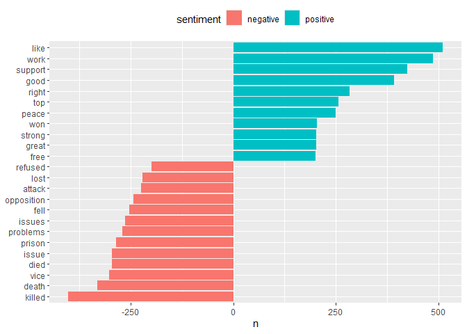
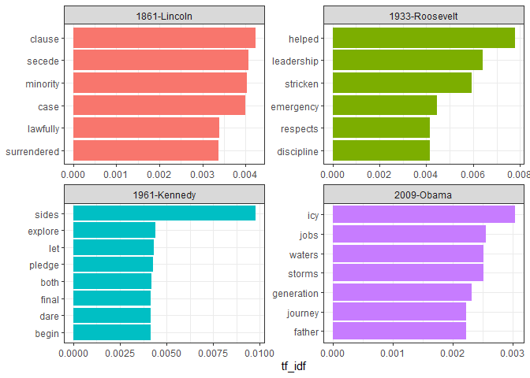
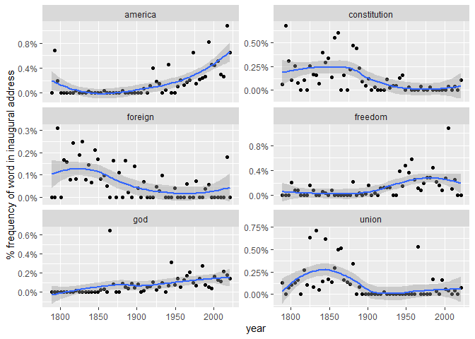

Converting to and from non-tidy formats
================

``` r
pacman::p_load(
        rio,            # import and export files
        here,           # locate files 
        tidyverse,      # data management and visualization
        tm,
        tidytext,
        topicmodels,
        quanteda
)
```

## Tidying `DocumentTermMatrix` objects

``` r
data("AssociatedPress", package = "topicmodels")

AssociatedPress
```

    ## <<DocumentTermMatrix (documents: 2246, terms: 10473)>>
    ## Non-/sparse entries: 302031/23220327
    ## Sparsity           : 99%
    ## Maximal term length: 18
    ## Weighting          : term frequency (tf)

Access terms in document

``` r
terms <- tm::Terms(AssociatedPress)

head(terms)
```

    ## [1] "aaron"      "abandon"    "abandoned"  "abandoning" "abbott"     "abboud"

Convert `DocumentTermMatrix` to one-token-per-document-per-row
dataframe. Including only **non-zero** values

``` r
(ap_td <- broom::tidy(AssociatedPress))
```

    ## # A tibble: 302,031 × 3
    ##    document term       count
    ##       <int> <chr>      <dbl>
    ##  1        1 adding         1
    ##  2        1 adult          2
    ##  3        1 ago            1
    ##  4        1 alcohol        1
    ##  5        1 allegedly      1
    ##  6        1 allen          1
    ##  7        1 apparently     2
    ##  8        1 appeared       1
    ##  9        1 arrested       1
    ## 10        1 assault        1
    ## # ℹ 302,021 more rows

Testing

``` r
ap_td %>%
        inner_join(get_sentiments("bing"),
                   by = c(term = "word"))
```

    ## # A tibble: 30,094 × 4
    ##    document term    count sentiment
    ##       <int> <chr>   <dbl> <chr>    
    ##  1        1 assault     1 negative 
    ##  2        1 complex     1 negative 
    ##  3        1 death       1 negative 
    ##  4        1 died        1 negative 
    ##  5        1 good        2 positive 
    ##  6        1 illness     1 negative 
    ##  7        1 killed      2 negative 
    ##  8        1 like        2 positive 
    ##  9        1 liked       1 positive 
    ## 10        1 miracle     1 positive 
    ## # ℹ 30,084 more rows

``` r
ap_td %>%
        inner_join(get_sentiments("bing"),
                   by = c(term = "word")) %>%
        count(sentiment, term, wt = count) %>%
        filter(n >= 200) %>%
        mutate(n = if_else(sentiment == "negative", -n, n)) %>%
        ggplot(aes(x = n,
                   y = fct_reorder(term, n),
                   fill = sentiment)) +
        geom_col() +
        labs(y = NULL) +
        theme(legend.position = "top")
```

<!-- -->

## Tidying `dfm` objects

``` r
data("data_corpus_inaugural", package = "quanteda")

(inaug_dfm <- data_corpus_inaugural %>%
        quanteda::tokens() %>%
        quanteda::dfm(verbose = FALSE))
```

    ## Document-feature matrix of: 59 documents, 9,437 features (91.84% sparse) and 4 docvars.
    ##                  features
    ## docs              fellow-citizens  of the senate and house representatives : among vicissitudes
    ##   1789-Washington               1  71 116      1  48     2               2 1     1            1
    ##   1793-Washington               0  11  13      0   2     0               0 1     0            0
    ##   1797-Adams                    3 140 163      1 130     0               2 0     4            0
    ##   1801-Jefferson                2 104 130      0  81     0               0 1     1            0
    ##   1805-Jefferson                0 101 143      0  93     0               0 0     7            0
    ##   1809-Madison                  1  69 104      0  43     0               0 0     0            0
    ## [ reached max_ndoc ... 53 more documents, reached max_nfeat ... 9,427 more features ]

Convert `dfm` to one-token-per-document-per-row dataframe.

``` r
(inaug_td <- tidy(inaug_dfm))
```

    ## # A tibble: 45,452 × 3
    ##    document        term            count
    ##    <chr>           <chr>           <dbl>
    ##  1 1789-Washington fellow-citizens     1
    ##  2 1797-Adams      fellow-citizens     3
    ##  3 1801-Jefferson  fellow-citizens     2
    ##  4 1809-Madison    fellow-citizens     1
    ##  5 1813-Madison    fellow-citizens     1
    ##  6 1817-Monroe     fellow-citizens     5
    ##  7 1821-Monroe     fellow-citizens     1
    ##  8 1841-Harrison   fellow-citizens    11
    ##  9 1845-Polk       fellow-citizens     1
    ## 10 1849-Taylor     fellow-citizens     1
    ## # ℹ 45,442 more rows

Find the words most specific to each of the inaugural speeches

``` r
(inaug_tf_idf <- inaug_td %>%
                bind_tf_idf(term, document, count) %>%
                arrange(desc(tf_idf)))
```

    ## # A tibble: 45,452 × 6
    ##    document        term        count      tf   idf tf_idf
    ##    <chr>           <chr>       <dbl>   <dbl> <dbl>  <dbl>
    ##  1 1793-Washington arrive          1 0.00680  4.08 0.0277
    ##  2 1793-Washington upbraidings     1 0.00680  4.08 0.0277
    ##  3 1793-Washington violated        1 0.00680  3.38 0.0230
    ##  4 1793-Washington willingly       1 0.00680  3.38 0.0230
    ##  5 1793-Washington incurring       1 0.00680  3.38 0.0230
    ##  6 1793-Washington previous        1 0.00680  2.98 0.0203
    ##  7 1793-Washington knowingly       1 0.00680  2.98 0.0203
    ##  8 1793-Washington injunctions     1 0.00680  2.98 0.0203
    ##  9 1793-Washington witnesses       1 0.00680  2.98 0.0203
    ## 10 1793-Washington besides         1 0.00680  2.69 0.0183
    ## # ℹ 45,442 more rows

Pick four notable inaugural addresses (from Presidents Lincoln,
Roosevelt, Kennedy, and Obama), and visualize the words most specific to
each speech

``` r
inaug_tf_idf %>% 
        filter(document %in% c("1861-Lincoln",
                               "1961-Kennedy",
                               "1933-Roosevelt",
                               "2009-Obama")) %>%
        group_by(document) %>%
        top_n(n = 6) %>%
        ungroup() %>%
        ggplot(aes(x = tf_idf,
                   y = reorder_within(term, tf_idf, document),
                   fill = document)) +
        geom_col(show.legend = FALSE) +
        scale_y_reordered() +
        facet_wrap(~document, ncol = 2, scales = "free") +
        labs(y = NULL) +
        theme_bw()
```

    ## Selecting by tf_idf

<!-- -->

Extract the year from each document’s name, and compute the total number
of words within each year.

``` r
(year_term_counts <- inaug_td %>%
        separate(col = document,
                 into = c("year", "president"),
                 sep = "-") %>%
        complete(year, term, fill = list(count = 0)) %>%
        group_by(year) %>%
        mutate(year_total = sum(count),
               year = as.integer(year)))
```

    ## # A tibble: 556,783 × 5
    ## # Groups:   year [59]
    ##     year term  president  count year_total
    ##    <int> <chr> <chr>      <dbl>      <dbl>
    ##  1  1789 "'"   <NA>           0       1537
    ##  2  1789 "-"   Washington     1       1537
    ##  3  1789 "–"   <NA>           0       1537
    ##  4  1789 "—"   <NA>           0       1537
    ##  5  1789 "!"   <NA>           0       1537
    ##  6  1789 "\""  Washington     2       1537
    ##  7  1789 "$"   <NA>           0       1537
    ##  8  1789 "("   Washington     1       1537
    ##  9  1789 ")"   Washington     1       1537
    ## 10  1789 ","   Washington    70       1537
    ## # ℹ 556,773 more rows

Pick several words + visualize how they changed in frequency over time

``` r
year_term_counts1 %>%
        filter(term %in% c("god",
                           "america",
                           "foreign",
                           "union",
                           "constitution",
                           "freedom")) %>%
        ggplot(aes(year,
                   count/year_total)) +
        geom_point() +
        geom_smooth() +
        facet_wrap(~term, ncol = 2, scales = "free_y") +
        scale_y_continuous(labels = scales::percent_format()) +
        labs(y = "% frequency of word in inaugural address")
```

    ## `geom_smooth()` using method = 'loess' and formula = 'y ~ x'

<!-- -->

## Casting tidy text data into a matrix

``` r
ap_td %>%
        cast_dtm(document, term, count)
```

    ## <<DocumentTermMatrix (documents: 2246, terms: 10473)>>
    ## Non-/sparse entries: 302031/23220327
    ## Sparsity           : 99%
    ## Maximal term length: 18
    ## Weighting          : term frequency (tf)

``` r
ap_td %>%
        cast_dfm(document, term, count)
```

    ## Document-feature matrix of: 2,246 documents, 10,473 features (98.72% sparse) and 0 docvars.
    ##     features
    ## docs adding adult ago alcohol allegedly allen apparently appeared arrested assault
    ##    1      1     2   1       1         1     1          2        1        1       1
    ##    2      0     0   0       0         0     0          0        1        0       0
    ##    3      0     0   1       0         0     0          0        1        0       0
    ##    4      0     0   3       0         0     0          0        0        0       0
    ##    5      0     0   0       0         0     0          0        0        0       0
    ##    6      0     0   2       0         0     0          0        0        0       0
    ## [ reached max_ndoc ... 2,240 more documents, reached max_nfeat ... 10,463 more features ]

``` r
(m <- ap_td %>%
        cast_sparse(document, term, count))
```

    ## 2246 x 10473 sparse Matrix of class "dgCMatrix"

    ##   [[ suppressing 75 column names 'adding', 'adult', 'ago' ... ]]
    ##   [[ suppressing 75 column names 'adding', 'adult', 'ago' ... ]]

    ##                                                                                                                                                               
    ## 1 1 2 1 1 1 1 2 1 1 1 2 1 1 2 1 1 1 1 4 4 1 1 1 1 1 1 1 2 1 1 4 1 1 1 1 1 1 2 1 1 1 1 2 2 1 1 2 1 1 1 1 1 2 1 1 1 1 1 2 2 1 1 1 1 1 2 1 2 1 1 1 3 3 1 1 ......
    ## 2 . . . . . . . 1 . . . . . . . . . . . . . . . . . . . . . . . . 1 . . . . . . . . . . . . . . . . . . . . . 1 . . . . . . . . . . . . . . . . . . . . ......
    ## 3 . . 1 . . . . 1 . . . . . . . . . . . . . . . . . . . . . . . . . . . . . 1 1 . . 1 3 . . . . . . . . . . . . . . . . . . . . . . . . . . . . 2 . . . ......
    ## 4 . . 3 . . . . . . . . . . . . . . . . . . . . . . . . . . . . . . . . . . . 2 . . . . . . . . . . . . . . . 3 . . . . . . . . . . . . . . . . . . . 2 ......
    ## 5 . . . . . . . . . . . . . . . . . . . . . . . . . . . . . . . . . . . . . . . . . . . . . . . . . . . . . . 1 . . . . . . . . . . . . . . . . . . . . ......
    ## 6 . . 2 . . . . . . . . . . . 1 . . . . . . . . . . . 1 . . . . . . . . . . . . . . . . . . . . . . . . . . . . . . . . . . . . . . . . . . . . . . . . ......
    ## 7 . . . . . . . . . . . . . . . . . . . . . . . . . . . . . . . 1 . . . . . . . . . 1 . . . . . . . . . . . . 1 . . . . 1 . . . . . . . . . . . . . . . ......
    ## 
    ##  ..............................
    ##  ........suppressing 10398 columns and 2233 rows in show(); maybe adjust options(max.print=, width=)
    ##  ..............................

    ##   [[ suppressing 75 column names 'adding', 'adult', 'ago' ... ]]

    ##                                                                                                                                                                  
    ## 2241 . . 1 . . . . . 1 . . . 1 . . . . . . . . . . . 1 . . . . . . . . . . 4 . . 1 . . . . . . . . . . . . . 1 . 1 . . . 2 2 . . . . . . . . . . . . . . . ......
    ## 2242 . . . . . . . . . . . . . . . . . . . . . . . . . . . . . . . . . . . . . . . . . . . . . . . . . . . . . . . . . . . . 2 . . . . . . . . . . . . . . ......
    ## 2243 . . . . . . . . . . . . . . . . . . . . . . . . . 1 . . . . . . . . . . . . . . . . . . . . . . . . . . . . . . . . . . . . . . . . . . . . . . . . . ......
    ## 2244 . . . . . . . . . . . . . . . . . . . . . . . . 1 . . . . . . . . . . 2 . . . . . . . . . . . . . . . . . . . . . . 1 . . . . . . . . . . . . . . . . ......
    ## 2245 . . . . . . . . . . . . . . . . . . . 3 . . . . . . . . . . . . 1 . . . . . . . . . . . . . . . . . . . . . . . . . . 2 . . . . . 1 . 2 . . . . . . . ......
    ## 2246 . . . . . . . . . . . . . . . . . . . . . . . . . . . . . 1 . . . . . . . . . . . . . . . . . . . . . . . . . . . . . . 1 . . . . . . . . . . . . . . ......

``` r
class(m)
```

    ## [1] "dgCMatrix"
    ## attr(,"package")
    ## [1] "Matrix"

``` r
dim(m)
```

    ## [1]  2246 10473

### Example: Jane Austen’s book

``` r
(austen <- janeaustenr::austen_books() %>%
        unnest_tokens(word, text) %>%
        count(book, word))
```

    ## # A tibble: 40,379 × 3
    ##    book                word      n
    ##    <fct>               <chr> <int>
    ##  1 Sense & Sensibility 1         2
    ##  2 Sense & Sensibility 10        1
    ##  3 Sense & Sensibility 11        1
    ##  4 Sense & Sensibility 12        1
    ##  5 Sense & Sensibility 13        1
    ##  6 Sense & Sensibility 14        1
    ##  7 Sense & Sensibility 15        1
    ##  8 Sense & Sensibility 16        1
    ##  9 Sense & Sensibility 17        1
    ## 10 Sense & Sensibility 18        1
    ## # ℹ 40,369 more rows

``` r
austen %>%
        cast_dtm(book, word, n)
```

    ## <<DocumentTermMatrix (documents: 6, terms: 14520)>>
    ## Non-/sparse entries: 40379/46741
    ## Sparsity           : 54%
    ## Maximal term length: 19
    ## Weighting          : term frequency (tf)

## Tidy `Corpus` object

``` r
data("acq")

acq
```

    ## <<VCorpus>>
    ## Metadata:  corpus specific: 0, document level (indexed): 0
    ## Content:  documents: 50

``` r
# 1st document
acq[[1]]
```

    ## <<PlainTextDocument>>
    ## Metadata:  15
    ## Content:  chars: 1287

``` r
# tidy corpus
(acq_td <- tidy(acq))
```

    ## # A tibble: 50 × 16
    ##    author                    datetimestamp       description heading        id    language origin topics lewissplit cgisplit oldid places people orgs  exchanges text 
    ##    <chr>                     <dttm>              <chr>       <chr>          <chr> <chr>    <chr>  <chr>  <chr>      <chr>    <chr> <name> <lgl>  <lgl> <lgl>     <chr>
    ##  1 <NA>                      1987-02-26 15:18:06 ""          COMPUTER TERM… 10    en       Reute… YES    TRAIN      TRAININ… 5553  <chr>  NA     NA    NA        "Com…
    ##  2 <NA>                      1987-02-26 15:19:15 ""          OHIO MATTRESS… 12    en       Reute… YES    TRAIN      TRAININ… 5555  <chr>  NA     NA    NA        "Ohi…
    ##  3 <NA>                      1987-02-26 15:49:56 ""          MCLEAN'S <MII… 44    en       Reute… YES    TRAIN      TRAININ… 5587  <chr>  NA     NA    NA        "McL…
    ##  4 By Cal Mankowski, Reuters 1987-02-26 15:51:17 ""          CHEMLAWN <CHE… 45    en       Reute… YES    TRAIN      TRAININ… 5588  <chr>  NA     NA    NA        "Che…
    ##  5 <NA>                      1987-02-26 16:08:33 ""          <COFAB INC> B… 68    en       Reute… YES    TRAIN      TRAININ… 5611  <chr>  NA     NA    NA        "CoF…
    ##  6 <NA>                      1987-02-26 16:32:37 ""          INVESTMENT FI… 96    en       Reute… YES    TRAIN      TRAININ… 5639  <chr>  NA     NA    NA        "A g…
    ##  7 By Patti Domm, Reuter     1987-02-26 16:43:13 ""          AMERICAN EXPR… 110   en       Reute… YES    TRAIN      TRAININ… 5653  <chr>  NA     NA    NA        "Ame…
    ##  8 <NA>                      1987-02-26 16:59:25 ""          HONG KONG FIR… 125   en       Reute… YES    TRAIN      TRAININ… 5668  <chr>  NA     NA    NA        "Ind…
    ##  9 <NA>                      1987-02-26 17:01:28 ""          LIEBERT CORP … 128   en       Reute… YES    TRAIN      TRAININ… 5671  <chr>  NA     NA    NA        "Lie…
    ## 10 <NA>                      1987-02-26 17:08:27 ""          GULF APPLIED … 134   en       Reute… YES    TRAIN      TRAININ… 5677  <chr>  NA     NA    NA        "Gul…
    ## # ℹ 40 more rows

``` r
(acq_tokens <- acq_td %>%
        select(-places) %>% 
        unnest_tokens(word, text) %>%
        anti_join(stop_words, by = "word"))
```

    ## # A tibble: 4,092 × 15
    ##    author datetimestamp       description heading                                  id    language origin topics lewissplit cgisplit oldid people orgs  exchanges word 
    ##    <chr>  <dttm>              <chr>       <chr>                                    <chr> <chr>    <chr>  <chr>  <chr>      <chr>    <chr> <lgl>  <lgl> <lgl>     <chr>
    ##  1 <NA>   1987-02-26 15:18:06 ""          COMPUTER TERMINAL SYSTEMS <CPML> COMPLE… 10    en       Reute… YES    TRAIN      TRAININ… 5553  NA     NA    NA        comp…
    ##  2 <NA>   1987-02-26 15:18:06 ""          COMPUTER TERMINAL SYSTEMS <CPML> COMPLE… 10    en       Reute… YES    TRAIN      TRAININ… 5553  NA     NA    NA        term…
    ##  3 <NA>   1987-02-26 15:18:06 ""          COMPUTER TERMINAL SYSTEMS <CPML> COMPLE… 10    en       Reute… YES    TRAIN      TRAININ… 5553  NA     NA    NA        syst…
    ##  4 <NA>   1987-02-26 15:18:06 ""          COMPUTER TERMINAL SYSTEMS <CPML> COMPLE… 10    en       Reute… YES    TRAIN      TRAININ… 5553  NA     NA    NA        comp…
    ##  5 <NA>   1987-02-26 15:18:06 ""          COMPUTER TERMINAL SYSTEMS <CPML> COMPLE… 10    en       Reute… YES    TRAIN      TRAININ… 5553  NA     NA    NA        sale 
    ##  6 <NA>   1987-02-26 15:18:06 ""          COMPUTER TERMINAL SYSTEMS <CPML> COMPLE… 10    en       Reute… YES    TRAIN      TRAININ… 5553  NA     NA    NA        200,…
    ##  7 <NA>   1987-02-26 15:18:06 ""          COMPUTER TERMINAL SYSTEMS <CPML> COMPLE… 10    en       Reute… YES    TRAIN      TRAININ… 5553  NA     NA    NA        shar…
    ##  8 <NA>   1987-02-26 15:18:06 ""          COMPUTER TERMINAL SYSTEMS <CPML> COMPLE… 10    en       Reute… YES    TRAIN      TRAININ… 5553  NA     NA    NA        comm…
    ##  9 <NA>   1987-02-26 15:18:06 ""          COMPUTER TERMINAL SYSTEMS <CPML> COMPLE… 10    en       Reute… YES    TRAIN      TRAININ… 5553  NA     NA    NA        stock
    ## 10 <NA>   1987-02-26 15:18:06 ""          COMPUTER TERMINAL SYSTEMS <CPML> COMPLE… 10    en       Reute… YES    TRAIN      TRAININ… 5553  NA     NA    NA        warr…
    ## # ℹ 4,082 more rows

``` r
# most common words
acq_tokens %>% count(word, sort = TRUE)
```

    ## # A tibble: 1,566 × 2
    ##    word         n
    ##    <chr>    <int>
    ##  1 dlrs       100
    ##  2 pct         70
    ##  3 mln         65
    ##  4 company     63
    ##  5 shares      52
    ##  6 reuter      50
    ##  7 stock       46
    ##  8 offer       34
    ##  9 share       34
    ## 10 american    28
    ## # ℹ 1,556 more rows

``` r
# tf-idf
acq_tokens %>%
        count(id, word) %>%
        bind_tf_idf(word, id, n) %>%
        arrange(desc(tf_idf))
```

    ## # A tibble: 2,853 × 6
    ##    id    word         n     tf   idf tf_idf
    ##    <chr> <chr>    <int>  <dbl> <dbl>  <dbl>
    ##  1 186   groupe       2 0.133   3.91  0.522
    ##  2 128   liebert      3 0.130   3.91  0.510
    ##  3 474   esselte      5 0.109   3.91  0.425
    ##  4 371   burdett      6 0.103   3.91  0.405
    ##  5 442   hazleton     4 0.103   3.91  0.401
    ##  6 199   circuit      5 0.102   3.91  0.399
    ##  7 162   suffield     2 0.1     3.91  0.391
    ##  8 498   west         3 0.1     3.91  0.391
    ##  9 441   rmj          8 0.121   3.22  0.390
    ## 10 467   nursery      3 0.0968  3.91  0.379
    ## # ℹ 2,843 more rows

``` r
# rmarkdown::render()
```
