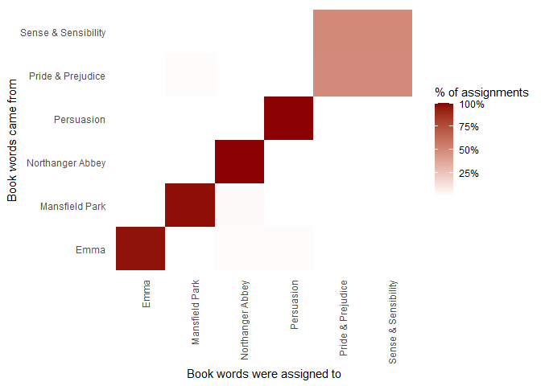

Topic modelling
================

``` r
pacman::p_load(
        rio,            # import and export files
        here,           # locate files 
        tidyverse,      # data management and visualization
        topicmodels,
        tidytext,
        janeaustenr,
        scales
)
```

## Latent Dirichlet allocation

``` r
# data
data("AssociatedPress")
AssociatedPress
```

    ## <<DocumentTermMatrix (documents: 2246, terms: 10473)>>
    ## Non-/sparse entries: 302031/23220327
    ## Sparsity           : 99%
    ## Maximal term length: 18
    ## Weighting          : term frequency (tf)

Fit model

``` r
ap_lda <- LDA(AssociatedPress, k = 2, control = list(seed = 1234))
ap_lda
```

    ## A LDA_VEM topic model with 2 topics.

### Word-topic probabilities

``` r
(ap_topics <- tidy(ap_lda, matrix = "beta"))
```

    ## # A tibble: 20,946 × 3
    ##    topic term           beta
    ##    <int> <chr>         <dbl>
    ##  1     1 aaron      1.69e-12
    ##  2     2 aaron      3.90e- 5
    ##  3     1 abandon    2.65e- 5
    ##  4     2 abandon    3.99e- 5
    ##  5     1 abandoned  1.39e- 4
    ##  6     2 abandoned  5.88e- 5
    ##  7     1 abandoning 2.45e-33
    ##  8     2 abandoning 2.34e- 5
    ##  9     1 abbott     2.13e- 6
    ## 10     2 abbott     2.97e- 5
    ## # ℹ 20,936 more rows

``` r
ap_topics %>%
        group_by(topic) %>%
        slice_max(beta, n = 10) %>%
        ungroup() %>%
        arrange(topic, -beta) %>%
        ggplot(aes(x = beta,
                   y = reorder_within(term, by = beta, within = topic),
                   fill = factor(topic))) +
        geom_col(show.legend = FALSE) +
        facet_wrap(~topic, scales = "free") +
        scale_y_reordered() +
        labs(y = NULL,
             title = "Most common within each topic")
```

<!-- -->

Greatest difference in β between topic 1 and topic 2

``` r
(beta_wide <- ap_topics %>%
        mutate(topic = paste0("topic", topic)) %>%
        pivot_wider(names_from = "topic",
                    values_from = "beta") %>%
        # filter for relatively common words, β > 1/1000 in at least 1 topic
        filter(topic1 > 0.001 | topic2 > 0.001) %>%
        mutate(log_ratio = log2(topic2 / topic1)))
```

    ## # A tibble: 198 × 4
    ##    term              topic1      topic2 log_ratio
    ##    <chr>              <dbl>       <dbl>     <dbl>
    ##  1 administration 0.000431  0.00138         1.68 
    ##  2 ago            0.00107   0.000842       -0.339
    ##  3 agreement      0.000671  0.00104         0.630
    ##  4 aid            0.0000476 0.00105         4.46 
    ##  5 air            0.00214   0.000297       -2.85 
    ##  6 american       0.00203   0.00168        -0.270
    ##  7 analysts       0.00109   0.000000578   -10.9  
    ##  8 area           0.00137   0.000231       -2.57 
    ##  9 army           0.000262  0.00105         2.00 
    ## 10 asked          0.000189  0.00156         3.05 
    ## # ℹ 188 more rows

``` r
# visualize
beta_wide %>%
        group_by(direction = log_ratio > 0) %>%
        slice_max(abs(log_ratio), n = 10) %>%
        ungroup() %>%
        ggplot(aes(x = log_ratio,
                   y = fct_reorder(term, log_ratio),
                   fill = direction)) +
        geom_col(show.legend = FALSE) +
        labs(x = "Log2 ratio of beta in topic 2 / topic 1",
             y = NULL)
```

<!-- -->

### Document-topic probabilities

``` r
(ap_documents <- tidy(ap_lda, matrix = "gamma"))
```

    ## # A tibble: 4,492 × 3
    ##    document topic    gamma
    ##       <int> <int>    <dbl>
    ##  1        1     1 0.248   
    ##  2        2     1 0.362   
    ##  3        3     1 0.527   
    ##  4        4     1 0.357   
    ##  5        5     1 0.181   
    ##  6        6     1 0.000588
    ##  7        7     1 0.773   
    ##  8        8     1 0.00445 
    ##  9        9     1 0.967   
    ## 10       10     1 0.147   
    ## # ℹ 4,482 more rows

## Example: the great library heist

### Pre-processing

``` r
# divide books into chapters --> treat every chapter as separate `document`
# separate chapters into words <-- unnest_tokens()
# remove stop_words
```

``` r
# divide into documents, each representing one chapter
(by_chapter <- austen_books() %>%
        group_by(book) %>%
        mutate(chapter = cumsum(str_detect(text,
                                           regex("^chapter ",
                                                 ignore_case = TRUE)))) %>%
        ungroup() %>%
        filter(chapter > 0) %>%
        unite(document, book, chapter))
```

    ## # A tibble: 73,347 × 2
    ##    text                                                                     document             
    ##    <chr>                                                                    <chr>                
    ##  1 "CHAPTER 1"                                                              Sense & Sensibility_1
    ##  2 ""                                                                       Sense & Sensibility_1
    ##  3 ""                                                                       Sense & Sensibility_1
    ##  4 "The family of Dashwood had long been settled in Sussex.  Their estate"  Sense & Sensibility_1
    ##  5 "was large, and their residence was at Norland Park, in the centre of"   Sense & Sensibility_1
    ##  6 "their property, where, for many generations, they had lived in so"      Sense & Sensibility_1
    ##  7 "respectable a manner as to engage the general good opinion of their"    Sense & Sensibility_1
    ##  8 "surrounding acquaintance.  The late owner of this estate was a single"  Sense & Sensibility_1
    ##  9 "man, who lived to a very advanced age, and who for many years of his"   Sense & Sensibility_1
    ## 10 "life, had a constant companion and housekeeper in his sister.  But her" Sense & Sensibility_1
    ## # ℹ 73,337 more rows

``` r
# split into words
(by_chapter_word <- by_chapter %>%
        unnest_tokens(word, text))
```

    ## # A tibble: 724,881 × 2
    ##    document              word    
    ##    <chr>                 <chr>   
    ##  1 Sense & Sensibility_1 chapter 
    ##  2 Sense & Sensibility_1 1       
    ##  3 Sense & Sensibility_1 the     
    ##  4 Sense & Sensibility_1 family  
    ##  5 Sense & Sensibility_1 of      
    ##  6 Sense & Sensibility_1 dashwood
    ##  7 Sense & Sensibility_1 had     
    ##  8 Sense & Sensibility_1 long    
    ##  9 Sense & Sensibility_1 been    
    ## 10 Sense & Sensibility_1 settled 
    ## # ℹ 724,871 more rows

``` r
# find document-word counts
(word_counts <- by_chapter_word %>%
        anti_join(stop_words) %>%
        count(document, word, sort = TRUE))
```

    ## Joining with `by = join_by(word)`

    ## # A tibble: 145,139 × 3
    ##    document          word        n
    ##    <chr>             <chr>   <int>
    ##  1 Persuasion_21     elliot     62
    ##  2 Emma_47           harriet    52
    ##  3 Emma_21           miss       44
    ##  4 Persuasion_12     anne       43
    ##  5 Persuasion_12     captain    42
    ##  6 Persuasion_11     captain    41
    ##  7 Mansfield Park_19 sir        40
    ##  8 Persuasion_21     smith      38
    ##  9 Mansfield Park_35 fanny      37
    ## 10 Persuasion_22     anne       37
    ## # ℹ 145,129 more rows

### LDA on chapters

``` r
# convert tidy dataframe to DocumentTermMatrix
(chapters_dtm <- word_counts %>%
                cast_dtm(document, word, n))
```

    ## <<DocumentTermMatrix (documents: 269, terms: 13908)>>
    ## Non-/sparse entries: 145139/3596113
    ## Sparsity           : 96%
    ## Maximal term length: 19
    ## Weighting          : term frequency (tf)

``` r
# create 6 topic model
(chapters_lda <- LDA(chapters_dtm, k = 6, control = list(seed = 1234)))
```

    ## A LDA_VEM topic model with 6 topics.

### Per-topic-per-word probabilities

``` r
(chapter_topics <- tidy(chapters_lda, matrix = "beta"))
```

    ## # A tibble: 83,448 × 3
    ##    topic term         beta
    ##    <int> <chr>       <dbl>
    ##  1     1 elliot  4.12e- 68
    ##  2     2 elliot  3.21e-255
    ##  3     3 elliot  6.45e-266
    ##  4     4 elliot  3.38e-252
    ##  5     5 elliot  9.51e-  3
    ##  6     6 elliot  5.12e- 41
    ##  7     1 harriet 2.97e- 22
    ##  8     2 harriet 4.33e- 12
    ##  9     3 harriet 9.46e-  3
    ## 10     4 harriet 9.03e-  5
    ## # ℹ 83,438 more rows

``` r
# find the top 5 terms within each topic
(top_terms <- chapter_topics %>%
        group_by(topic) %>%
        slice_max(beta, n = 5) %>%
        ungroup() %>%
        arrange(topic, -beta))
```

    ## # A tibble: 30 × 3
    ##    topic term         beta
    ##    <int> <chr>       <dbl>
    ##  1     1 fanny     0.0186 
    ##  2     1 crawford  0.0115 
    ##  3     1 miss      0.00973
    ##  4     1 sir       0.00896
    ##  5     1 edmund    0.00842
    ##  6     2 elinor    0.00974
    ##  7     2 elizabeth 0.00931
    ##  8     2 marianne  0.00769
    ##  9     2 miss      0.00693
    ## 10     2 sister    0.00607
    ## # ℹ 20 more rows

``` r
# visualize
top_terms %>%
        ggplot(aes(x = beta,
                   y = reorder_within(term, beta, topic),
                   fill = factor(topic))) +
        geom_col(show.legend = FALSE) +
        facet_wrap(~topic, scales = "free") +
        scale_y_reordered() +
        labs(y = NULL)
```

<!-- -->

### Per-document classification

``` r
(chapters_gamma <- tidy(chapters_lda, matrix = "gamma"))
```

    ## # A tibble: 1,614 × 3
    ##    document          topic     gamma
    ##    <chr>             <int>     <dbl>
    ##  1 Persuasion_21         1 0.0000112
    ##  2 Emma_47               1 0.0000173
    ##  3 Emma_21               1 0.0000204
    ##  4 Persuasion_12         1 0.0000130
    ##  5 Persuasion_11         1 0.0000211
    ##  6 Mansfield Park_19     1 0.478    
    ##  7 Mansfield Park_35     1 0.902    
    ##  8 Persuasion_22         1 0.0000122
    ##  9 Persuasion_23         1 0.0000111
    ## 10 Emma_26               1 0.0000119
    ## # ℹ 1,604 more rows

``` r
# re-separate the document name into title and chapter
(chapters_gamma2 <- chapters_gamma %>%
        separate(col = document,
                 into = c("title", "chapter"),
                 sep = "_",
                 convert = TRUE)) 
```

    ## # A tibble: 1,614 × 4
    ##    title          chapter topic     gamma
    ##    <chr>            <int> <int>     <dbl>
    ##  1 Persuasion          21     1 0.0000112
    ##  2 Emma                47     1 0.0000173
    ##  3 Emma                21     1 0.0000204
    ##  4 Persuasion          12     1 0.0000130
    ##  5 Persuasion          11     1 0.0000211
    ##  6 Mansfield Park      19     1 0.478    
    ##  7 Mansfield Park      35     1 0.902    
    ##  8 Persuasion          22     1 0.0000122
    ##  9 Persuasion          23     1 0.0000111
    ## 10 Emma                26     1 0.0000119
    ## # ℹ 1,604 more rows

``` r
chapters_gamma2 %>%
        mutate(title = reorder(title, gamma * topic)) %>%
        ggplot(aes(x = factor(topic), y = gamma)) +
        geom_boxplot() +
        facet_wrap(~title) +
        labs(x = "Topic", y = expression(gamma))
```

<!-- -->

Are there any cases where the topic most associated with a chapter
belonged to another book?

``` r
(chapter_classifications <- chapters_gamma2 %>%
        group_by(title, chapter) %>%
        slice_max(gamma) %>%
        ungroup())
```

    ## # A tibble: 269 × 4
    ##    title chapter topic gamma
    ##    <chr>   <int> <int> <dbl>
    ##  1 Emma        1     3 1.00 
    ##  2 Emma        2     3 0.973
    ##  3 Emma        3     3 1.00 
    ##  4 Emma        4     3 1.00 
    ##  5 Emma        5     3 1.00 
    ##  6 Emma        6     3 1.00 
    ##  7 Emma        7     3 0.939
    ##  8 Emma        8     3 1.00 
    ##  9 Emma        9     3 0.544
    ## 10 Emma       10     3 0.883
    ## # ℹ 259 more rows

Compare each to the “consensus” topic for each book (aka the most common
topic among its chapters) –\> which were most often misidentified?

``` r
(book_topics <- chapter_classifications %>%
        count(title, topic) %>%
        group_by(title) %>%
        slice_max(n, n = 1) %>% 
        ungroup() %>%
        transmute(consensus = title,
                  topic))
```

    ## # A tibble: 6 × 2
    ##   consensus           topic
    ##   <chr>               <int>
    ## 1 Emma                    3
    ## 2 Mansfield Park          1
    ## 3 Northanger Abbey        4
    ## 4 Persuasion              5
    ## 5 Pride & Prejudice       2
    ## 6 Sense & Sensibility     2

``` r
chapter_classifications %>%
        inner_join(book_topics, by = "topic") %>%
        filter(title != consensus)
```

    ## Warning in inner_join(., book_topics, by = "topic"): Detected an unexpected many-to-many relationship between `x` and `y`.
    ## ℹ Row 159 of `x` matches multiple rows in `y`.
    ## ℹ Row 1 of `y` matches multiple rows in `x`.
    ## ℹ If a many-to-many relationship is expected, set `relationship = "many-to-many"` to silence this warning.

    ## # A tibble: 106 × 5
    ##    title             chapter topic gamma consensus          
    ##    <chr>               <int> <int> <dbl> <chr>              
    ##  1 Pride & Prejudice       1     2 1.00  Sense & Sensibility
    ##  2 Pride & Prejudice       2     2 1.00  Sense & Sensibility
    ##  3 Pride & Prejudice       3     2 0.846 Sense & Sensibility
    ##  4 Pride & Prejudice       4     2 0.930 Sense & Sensibility
    ##  5 Pride & Prejudice       5     2 1.00  Sense & Sensibility
    ##  6 Pride & Prejudice       6     2 0.990 Sense & Sensibility
    ##  7 Pride & Prejudice       7     2 0.974 Sense & Sensibility
    ##  8 Pride & Prejudice       8     2 0.958 Sense & Sensibility
    ##  9 Pride & Prejudice       9     2 1.00  Sense & Sensibility
    ## 10 Pride & Prejudice      10     2 0.715 Sense & Sensibility
    ## # ℹ 96 more rows

### By word assignments: `augment`

``` r
(assignments <- augment(chapters_lda, data = chapters_dtm))
```

    ## # A tibble: 145,139 × 4
    ##    document      term   count .topic
    ##    <chr>         <chr>  <dbl>  <dbl>
    ##  1 Persuasion_21 elliot    62      5
    ##  2 Persuasion_12 elliot    14      5
    ##  3 Persuasion_22 elliot    25      5
    ##  4 Persuasion_23 elliot     5      5
    ##  5 Persuasion_17 elliot    21      5
    ##  6 Persuasion_3  elliot     7      5
    ##  7 Persuasion_9  elliot     1      5
    ##  8 Persuasion_5  elliot     2      5
    ##  9 Persuasion_18 elliot     4      5
    ## 10 Persuasion_20 elliot    14      5
    ## # ℹ 145,129 more rows

``` r
(assignments2 <- assignments %>%
        separate(col = document,
                 into = c("title", "chapter"), 
                 sep = "_",
                 convert = TRUE) %>%
        inner_join(book_topics,
                   by = c(".topic" = "topic")))
```

    ## Warning in inner_join(., book_topics, by = c(.topic = "topic")): Detected an unexpected many-to-many relationship between `x` and `y`.
    ## ℹ Row 82 of `x` matches multiple rows in `y`.
    ## ℹ Row 4 of `y` matches multiple rows in `x`.
    ## ℹ If a many-to-many relationship is expected, set `relationship = "many-to-many"` to silence this warning.

    ## # A tibble: 179,726 × 6
    ##    title      chapter term   count .topic consensus 
    ##    <chr>        <int> <chr>  <dbl>  <dbl> <chr>     
    ##  1 Persuasion      21 elliot    62      5 Persuasion
    ##  2 Persuasion      12 elliot    14      5 Persuasion
    ##  3 Persuasion      22 elliot    25      5 Persuasion
    ##  4 Persuasion      23 elliot     5      5 Persuasion
    ##  5 Persuasion      17 elliot    21      5 Persuasion
    ##  6 Persuasion       3 elliot     7      5 Persuasion
    ##  7 Persuasion       9 elliot     1      5 Persuasion
    ##  8 Persuasion       5 elliot     2      5 Persuasion
    ##  9 Persuasion      18 elliot     4      5 Persuasion
    ## 10 Persuasion      20 elliot    14      5 Persuasion
    ## # ℹ 179,716 more rows

`confusion matrix`

``` r
assignments2 %>%
        count(title, consensus, wt = count) %>%
        mutate(across(c(title, consensus),
                      ~str_wrap(., 20)))  %>%
        group_by(title) %>%
        mutate(percent = n / sum(n)) %>%
        ggplot(aes(consensus, title, fill = percent)) +
        geom_tile() +
        scale_fill_gradient2(high = "darkred", label = percent_format()) +
        theme_minimal() +
        theme(axis.text.x = element_text(angle = 90, hjust = 1),
              panel.grid = element_blank()) +
        labs(x = "Book words were assigned to",
             y = "Book words came from",
             fill = "% of assignments")
```

<!-- -->

What were the most commonly mistaken words?

``` r
(wrong_words <- assignments2 %>%
                filter(title != consensus))
```

    ## # A tibble: 49,559 × 6
    ##    title               chapter term    count .topic consensus          
    ##    <chr>                 <int> <chr>   <dbl>  <dbl> <chr>              
    ##  1 Pride & Prejudice        39 harriet     1      3 Emma               
    ##  2 Pride & Prejudice        18 miss       10      2 Sense & Sensibility
    ##  3 Sense & Sensibility      29 miss        3      2 Pride & Prejudice  
    ##  4 Sense & Sensibility      21 miss       27      2 Pride & Prejudice  
    ##  5 Sense & Sensibility      22 miss        6      2 Pride & Prejudice  
    ##  6 Sense & Sensibility      35 miss        2      2 Pride & Prejudice  
    ##  7 Sense & Sensibility      37 miss        5      2 Pride & Prejudice  
    ##  8 Sense & Sensibility      43 miss        5      2 Pride & Prejudice  
    ##  9 Sense & Sensibility      27 miss        4      2 Pride & Prejudice  
    ## 10 Sense & Sensibility      20 miss        5      2 Pride & Prejudice  
    ## # ℹ 49,549 more rows

``` r
wrong_words %>%
        count(title, consensus, term, wt = count) %>%
        ungroup() %>%
        arrange(desc(n))
```

    ## # A tibble: 13,247 × 4
    ##    title               consensus           term          n
    ##    <chr>               <chr>               <chr>     <dbl>
    ##  1 Sense & Sensibility Pride & Prejudice   elinor      623
    ##  2 Pride & Prejudice   Sense & Sensibility elizabeth   597
    ##  3 Sense & Sensibility Pride & Prejudice   marianne    492
    ##  4 Pride & Prejudice   Sense & Sensibility darcy       373
    ##  5 Pride & Prejudice   Sense & Sensibility bennet      294
    ##  6 Pride & Prejudice   Sense & Sensibility miss        276
    ##  7 Pride & Prejudice   Sense & Sensibility jane        263
    ##  8 Pride & Prejudice   Sense & Sensibility bingley     257
    ##  9 Sense & Sensibility Pride & Prejudice   dashwood    231
    ## 10 Sense & Sensibility Pride & Prejudice   sister      229
    ## # ℹ 13,237 more rows

E.g.: `Bingley` appears only in `Pride & Prejudice`, even though it’s
assigned to `Sense & Sensibility`

``` r
word_counts %>%
        filter(word == "bingley") %>% 
        separate(document, c("book", "chapter"), sep = "_") %>% 
        count(book)
```

    ## # A tibble: 1 × 2
    ##   book                  n
    ##   <chr>             <int>
    ## 1 Pride & Prejudice    42

``` r
# rmarkdown::render()
```
