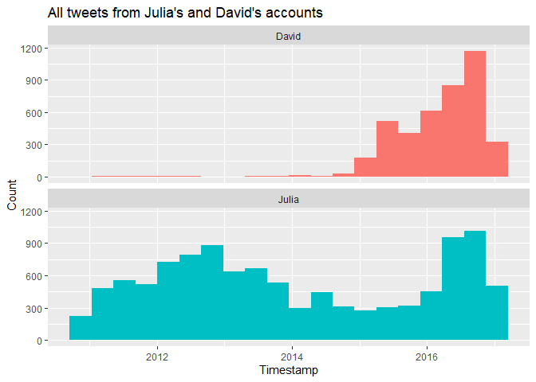
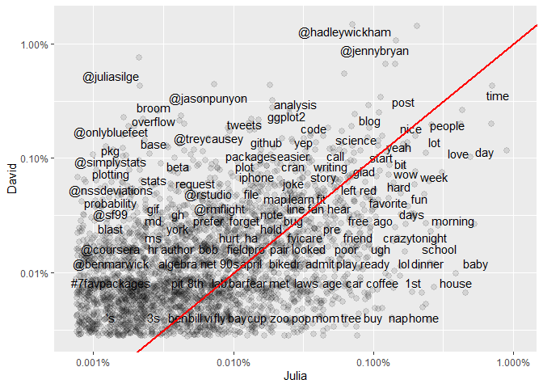
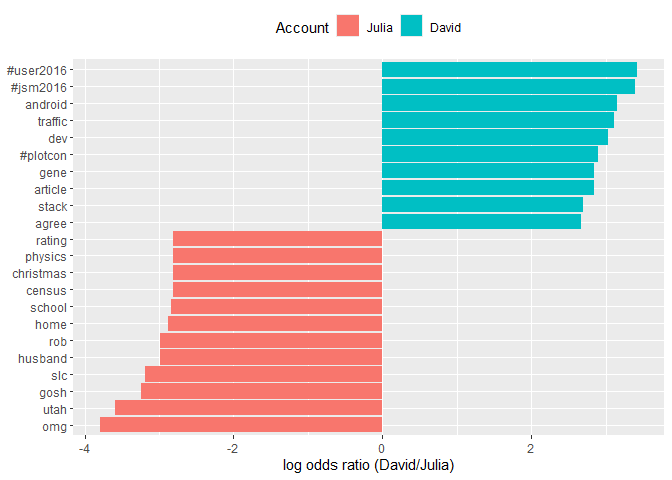
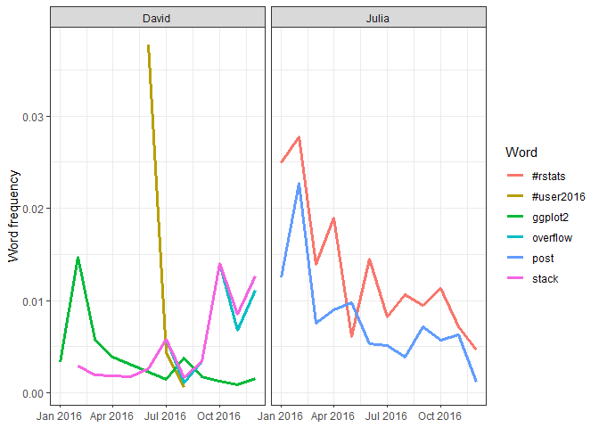

Case study - comparing Twitter archives
================

``` r
pacman::p_load(
        rio,            # import and export files
        here,           # locate files 
        tidyverse,      # data management and visualization
        lubridate,
        tidytext
)
```

## Data

``` r
(tweets_julia <- rio::import(here("text_mining_c07_example/tweets_julia.csv")) %>%
        tibble())
```

    ## # A tibble: 13,091 × 10
    ##    tweet_id in_reply_to_status_id in_reply_to_user_id timestamp           source text  retweeted_status_id retweeted_status_use…¹ retweeted_status_tim…² expanded_urls
    ##     <int64>               <int64>             <int64> <dttm>              <chr>  <chr>             <int64>                <int64> <dttm>                 <chr>        
    ##  1    8.e17                 8.e17            33559167 2017-01-01 21:48:41 "<a h… "@Jo…                  NA                     NA NA                     ""           
    ##  2    8.e17                 8.e17            13074042 2017-01-01 21:16:16 "<a h… "I l…                  NA                     NA NA                     ""           
    ##  3    8.e17                 8.e17            13074042 2017-01-01 21:13:45 "<a h… "BRE…                  NA                     NA NA                     ""           
    ##  4    8.e17                NA                      NA 2017-01-01 21:12:15 "<a h… "So …                  NA                     NA NA                     "http://www.…
    ##  5    8.e17                 8.e17            14173097 2017-01-01 14:21:48 "<a h… "@as…                  NA                     NA NA                     ""           
    ##  6    8.e17                 8.e17          1823987821 2017-01-01 07:08:41 "<a h… "@nj…                  NA                     NA NA                     ""           
    ##  7    8.e17                 8.e17          2837127738 2017-01-01 07:08:19 "<a h… "@qs…                  NA                     NA NA                     ""           
    ##  8    8.e17                 8.e17          1823987821 2017-01-01 07:06:50 "<a h… "@nj…                  NA                     NA NA                     ""           
    ##  9    8.e17                 8.e17            13074042 2017-01-01 07:02:34 "<a h… "(We…                  NA                     NA NA                     "https://twi…
    ## 10    8.e17                 8.e17            13074042 2017-01-01 05:18:59 "<a h… "It …                  NA                     NA NA                     "https://twi…
    ## # ℹ 13,081 more rows
    ## # ℹ abbreviated names: ¹​retweeted_status_user_id, ²​retweeted_status_timestamp

``` r
(tweets_dave <- rio::import(here("text_mining_c07_example/tweets_dave.csv")) %>%
        tibble())
```

    ## # A tibble: 4,174 × 10
    ##    tweet_id in_reply_to_status_id in_reply_to_user_id timestamp           source text  retweeted_status_id retweeted_status_use…¹ retweeted_status_tim…² expanded_urls
    ##     <int64>               <int64>             <int64> <dttm>              <chr>  <chr>             <int64>                <int64> <dttm>                 <chr>        
    ##  1    8.e17                NA                      NA 2017-01-03 02:26:59 "<a h… "RT …               8.e17              634734888 2017-01-03 00:43:45    "https://twi…
    ##  2    8.e17                NA                      NA 2017-01-02 12:08:59 "<a h… "RT …               7 e17             2842614819 2016-09-14 15:32:16    "https://twi…
    ##  3    8.e17                NA                      NA 2017-01-01 19:31:17 "<a h… "RT …               8.e17               69133574 2017-01-01 18:44:45    "http://amzn…
    ##  4    8.e17                NA                      NA 2017-01-01 18:24:36 "<a h… "RT …               8 e17              756459446 2016-12-25 20:15:49    ""           
    ##  5    8.e17                NA                      NA 2017-01-01 01:24:50 "<a h… "RT …               8 e17             2724597409 2016-12-31 03:03:47    "http://elli…
    ##  6    8.e17                 8.e17          3230388598 2016-12-31 23:20:43 "<a h… "@da…              NA                         NA NA                     "https://twi…
    ##  7    8 e17                NA                      NA 2016-12-31 00:05:45 "<a h… "RT …               8 e17               14254939 2016-12-30 23:20:53    "https://med…
    ##  8    8 e17                 8 e17            14254939 2016-12-30 17:32:30 "<a h… "@jc…              NA                         NA NA                     "https://twi…
    ##  9    8 e17                 8 e17            24228154 2016-12-29 18:59:32 "<a h… "@hs…              NA                         NA NA                     "https://www…
    ## 10    8 e17                 8 e17            24228154 2016-12-29 18:55:47 "<a h… "@hs…              NA                         NA NA                     ""           
    ## # ℹ 4,164 more rows
    ## # ℹ abbreviated names: ¹​retweeted_status_user_id, ²​retweeted_status_timestamp

``` r
(tweets <- bind_rows(tweets_julia %>% mutate(person = "Julia"),
          tweets_dave %>% mutate(person = "David")) %>%
        mutate(timestamp = ymd_hms(timestamp)))
```

    ## Warning: There was 1 warning in `mutate()`.
    ## ℹ In argument: `timestamp = ymd_hms(timestamp)`.
    ## Caused by warning:
    ## !  2216 failed to parse.

    ## # A tibble: 17,265 × 11
    ##    tweet_id in_reply_to_status_id in_reply_to_user_id timestamp           source text  retweeted_status_id retweeted_status_use…¹ retweeted_status_tim…² expanded_urls
    ##     <int64>               <int64>             <int64> <dttm>              <chr>  <chr>             <int64>                <int64> <dttm>                 <chr>        
    ##  1    8.e17                 8.e17            33559167 2017-01-01 21:48:41 "<a h… "@Jo…                  NA                     NA NA                     ""           
    ##  2    8.e17                 8.e17            13074042 2017-01-01 21:16:16 "<a h… "I l…                  NA                     NA NA                     ""           
    ##  3    8.e17                 8.e17            13074042 2017-01-01 21:13:45 "<a h… "BRE…                  NA                     NA NA                     ""           
    ##  4    8.e17                NA                      NA 2017-01-01 21:12:15 "<a h… "So …                  NA                     NA NA                     "http://www.…
    ##  5    8.e17                 8.e17            14173097 2017-01-01 14:21:48 "<a h… "@as…                  NA                     NA NA                     ""           
    ##  6    8.e17                 8.e17          1823987821 2017-01-01 07:08:41 "<a h… "@nj…                  NA                     NA NA                     ""           
    ##  7    8.e17                 8.e17          2837127738 2017-01-01 07:08:19 "<a h… "@qs…                  NA                     NA NA                     ""           
    ##  8    8.e17                 8.e17          1823987821 2017-01-01 07:06:50 "<a h… "@nj…                  NA                     NA NA                     ""           
    ##  9    8.e17                 8.e17            13074042 2017-01-01 07:02:34 "<a h… "(We…                  NA                     NA NA                     "https://twi…
    ## 10    8.e17                 8.e17            13074042 2017-01-01 05:18:59 "<a h… "It …                  NA                     NA NA                     "https://twi…
    ## # ℹ 17,255 more rows
    ## # ℹ abbreviated names: ¹​retweeted_status_user_id, ²​retweeted_status_timestamp
    ## # ℹ 1 more variable: person <chr>

## Distribution of tweets

``` r
tweets %>% 
        ggplot(aes(x = timestamp,
                   fill = person)) +
        geom_histogram(position = "identity",
                       bins = 20,
                       show.legend = FALSE) +
        facet_wrap(~person, ncol = 1) +
        labs(x = "Timestamp",
             y = "Count",
             title = "All tweets from Julia's and David's accounts")
```

    ## Warning: Removed 2216 rows containing non-finite outside the scale range (`stat_bin()`).

<!-- -->

David and Julia joined Twitter about a year apart from each other.  
There were about 5 years: David was not active on Twitter, Julia was.  
=\> In total, Julia has about 4 times as many tweets as David.

## word frequencies

``` r
replace_reg <- "https://t.co/[A-Za-z\\d]+|http://[A-Za-z\\d]+|&amp;|&lt;|&gt;|RT|https"
unnest_reg <- "([^A-Za-z_\\d#@']|'(?![A-Za-z_\\d#@]))"

(tidy_tweets <- tweets %>% 
        filter(!str_detect(text, "^RT")) %>%
        mutate(text = str_replace_all(text, replace_reg, "")) %>%
        unnest_tokens(word, 
                      text, 
                      token = "regex",
                      pattern = unnest_reg) %>%
        filter(!word %in% stop_words$word,
               !word %in% str_remove_all(stop_words$word, "'"),
               str_detect(word, "[a-z]")))
```

    ## # A tibble: 94,691 × 11
    ##    tweet_id in_reply_to_status_id in_reply_to_user_id timestamp           source       retweeted_status_id retweeted_status_use…¹ retweeted_status_tim…² expanded_urls
    ##     <int64>               <int64>             <int64> <dttm>              <chr>                    <int64>                <int64> <dttm>                 <chr>        
    ##  1    8.e17                 8.e17            33559167 2017-01-01 21:48:41 "<a href=\"…                  NA                     NA NA                     ""           
    ##  2    8.e17                 8.e17            33559167 2017-01-01 21:48:41 "<a href=\"…                  NA                     NA NA                     ""           
    ##  3    8.e17                 8.e17            33559167 2017-01-01 21:48:41 "<a href=\"…                  NA                     NA NA                     ""           
    ##  4    8.e17                 8.e17            33559167 2017-01-01 21:48:41 "<a href=\"…                  NA                     NA NA                     ""           
    ##  5    8.e17                 8.e17            13074042 2017-01-01 21:16:16 "<a href=\"…                  NA                     NA NA                     ""           
    ##  6    8.e17                 8.e17            13074042 2017-01-01 21:16:16 "<a href=\"…                  NA                     NA NA                     ""           
    ##  7    8.e17                 8.e17            13074042 2017-01-01 21:16:16 "<a href=\"…                  NA                     NA NA                     ""           
    ##  8    8.e17                 8.e17            13074042 2017-01-01 21:16:16 "<a href=\"…                  NA                     NA NA                     ""           
    ##  9    8.e17                 8.e17            13074042 2017-01-01 21:16:16 "<a href=\"…                  NA                     NA NA                     ""           
    ## 10    8.e17                 8.e17            13074042 2017-01-01 21:13:45 "<a href=\"…                  NA                     NA NA                     ""           
    ## # ℹ 94,681 more rows
    ## # ℹ abbreviated names: ¹​retweeted_status_user_id, ²​retweeted_status_timestamp
    ## # ℹ 2 more variables: person <chr>, word <chr>

Calculate word frequencies for each person

``` r
(frequency <- tidy_tweets %>%
        count(person, word, sort = TRUE) %>%
        group_by(person) %>%
        mutate(total = sum(n),
               freq = n/total))
```

    ## # A tibble: 20,722 × 5
    ## # Groups:   person [2]
    ##    person word               n total    freq
    ##    <chr>  <chr>          <int> <int>   <dbl>
    ##  1 Julia  time             584 74541 0.00783
    ##  2 Julia  @selkie1970      570 74541 0.00765
    ##  3 Julia  @skedman         531 74541 0.00712
    ##  4 Julia  day              467 74541 0.00627
    ##  5 Julia  baby             408 74541 0.00547
    ##  6 David  @hadleywickham   315 20150 0.0156 
    ##  7 Julia  love             304 74541 0.00408
    ##  8 Julia  @haleynburke     299 74541 0.00401
    ##  9 Julia  house            289 74541 0.00388
    ## 10 Julia  morning          278 74541 0.00373
    ## # ℹ 20,712 more rows

Visualize

``` r
frequency %>%
        select(-n, -total) %>%
        pivot_wider(names_from = person,
                    values_from = freq) %>%
        ggplot(aes(x = Julia,
                   y = David)) +
        geom_jitter(alpha = 0.1, size = 2.5, width = 0.25, height = 0.25) +
        geom_text(aes(label = word), check_overlap = TRUE, vjust = 1.5) +
        scale_x_log10(labels = scales::percent_format()) +
        scale_y_log10(labels = scales::percent_format()) +
        geom_abline(color = "red", size = 1)
```

    ## Warning: Removed 14536 rows containing missing values or values outside the scale range (`geom_point()`).

    ## Warning: Removed 14536 rows containing missing values or values outside the scale range (`geom_text()`).

<!-- -->

=\> Words near red line: used with equal frequencies by David and
Julia.  
=\> Words far away from the line: used much more by one person compared
to the other.  
David: used Twitter for professional purposes.  
Julia: used Twitter for personal purposes.

## Comparing word usage

``` r
# filter tweets during 2016
(tidy_tweets_2016 <- tidy_tweets %>%
        filter(timestamp >= as.Date("2016-01-01"),
               timestamp < as.Date("2017-01-01")))
```

    ## # A tibble: 25,893 × 11
    ##    tweet_id in_reply_to_status_id in_reply_to_user_id timestamp           source       retweeted_status_id retweeted_status_use…¹ retweeted_status_tim…² expanded_urls
    ##     <int64>               <int64>             <int64> <dttm>              <chr>                    <int64>                <int64> <dttm>                 <chr>        
    ##  1    8.e17                 8.e17          3230388598 2016-12-31 22:34:39 "<a href=\"…                  NA                     NA NA                     "https://twi…
    ##  2    8.e17                 8.e17              847081 2016-12-31 17:50:50 "<a href=\"…                  NA                     NA NA                     ""           
    ##  3    8.e17                 8.e17              847081 2016-12-31 17:50:50 "<a href=\"…                  NA                     NA NA                     ""           
    ##  4    8.e17                 8.e17              847081 2016-12-31 17:50:50 "<a href=\"…                  NA                     NA NA                     ""           
    ##  5    8.e17                 8.e17              847081 2016-12-31 17:50:50 "<a href=\"…                  NA                     NA NA                     ""           
    ##  6    8.e17                 8.e17              847081 2016-12-31 17:50:50 "<a href=\"…                  NA                     NA NA                     ""           
    ##  7    8 e17                 8 e17          2724597409 2016-12-31 15:15:24 "<a href=\"…                  NA                     NA NA                     "http://tidy…
    ##  8    8 e17                 8 e17          2724597409 2016-12-31 15:15:24 "<a href=\"…                  NA                     NA NA                     "http://tidy…
    ##  9    8 e17                 8 e17          2724597409 2016-12-31 15:15:24 "<a href=\"…                  NA                     NA NA                     "http://tidy…
    ## 10    8 e17                 8 e17          2724597409 2016-12-31 15:15:24 "<a href=\"…                  NA                     NA NA                     "http://tidy…
    ## # ℹ 25,883 more rows
    ## # ℹ abbreviated names: ¹​retweeted_status_user_id, ²​retweeted_status_timestamp
    ## # ℹ 2 more variables: person <chr>, word <chr>

``` r
(word_ratios <- tidy_tweets_2016 %>%
        # remove Twitter usernames
        filter(!str_detect(word, "^@")) %>%
        count(word, person) %>% 
        # keep only the words used more than 10 times
        group_by(word) %>%
        filter(sum(n) >= 10) %>%
        ungroup() %>%
        pivot_wider(names_from = person,
                    values_from = n,
                    values_fill = 0) %>%
        mutate_if(is.numeric, list(~(. + 1) / (sum(.) + 1))) %>%
        mutate(logratio = log(David / Julia)) %>%
        arrange(desc(logratio)))
```

    ## # A tibble: 377 × 4
    ##    word        David    Julia logratio
    ##    <chr>       <dbl>    <dbl>    <dbl>
    ##  1 #user2016 0.00779 0.000254     3.43
    ##  2 #jsm2016  0.00757 0.000254     3.40
    ##  3 android   0.00596 0.000254     3.16
    ##  4 traffic   0.00573 0.000254     3.12
    ##  5 dev       0.00527 0.000254     3.03
    ##  6 #plotcon  0.00459 0.000254     2.89
    ##  7 article   0.00436 0.000254     2.84
    ##  8 gene      0.00436 0.000254     2.84
    ##  9 stack     0.0112  0.000761     2.69
    ## 10 agree     0.00367 0.000254     2.67
    ## # ℹ 367 more rows

Words that have been about equally likely to come from David or Julia’s
account during 2016?

``` r
word_ratios %>% 
        arrange(abs(logratio))
```

    ## # A tibble: 377 × 4
    ##    word         David   Julia logratio
    ##    <chr>        <dbl>   <dbl>    <dbl>
    ##  1 email      0.00229 0.00228  0.00463
    ##  2 file       0.00229 0.00228  0.00463
    ##  3 map        0.00252 0.00254 -0.00543
    ##  4 names      0.00413 0.00406  0.0170 
    ##  5 account    0.00183 0.00177  0.0328 
    ##  6 api        0.00183 0.00177  0.0328 
    ##  7 function   0.00367 0.00355  0.0328 
    ##  8 population 0.00183 0.00177  0.0328 
    ##  9 sad        0.00183 0.00177  0.0328 
    ## 10 words      0.00367 0.00355  0.0328 
    ## # ℹ 367 more rows

Which words are most likely to be from Julia’s account or from David’s
account?

``` r
word_ratios %>%
        group_by(direction = logratio > 0) %>%
        slice_max(abs(logratio), n = 10) %>%
        ungroup() %>%
        ggplot(aes(x = logratio,
                   y = fct_reorder(word, logratio),
                   fill = logratio > 0)) +
        geom_col() +
        labs(x = "log odds ratio (David/Julia)",
             y = NULL,
             fill = "Account") +
        scale_fill_discrete(labels = c("Julia", "David")) +
        theme(legend.position = "top")
```

<!-- -->

## Changes in word use

Which words’ frequencies have changed the fastest in Twitter feeds?  
Aka which words were tweeted about at a higher or lower rate as time has
passed?

``` r
(words_by_time <- tidy_tweets_2016 %>%
        # remove Twitter usernames
        filter(!str_detect(word, "^@")) %>%
        # which unit of time (e.g., month) each tweet was posted in
        mutate(time_floor = floor_date(timestamp, unit = "1 month")) %>%
        # how many times each author used each word in each time bin
        count(time_floor, person, word) %>%
        # total number of words used in each time bin by each person
        group_by(person, time_floor) %>%
        mutate(time_total = sum(n)) %>%
        # total number of times each word was used by each person
        group_by(person, word) %>%
        mutate(word_total = sum(n)) %>%
        ungroup() %>%
        # keep words used at least 30 times
        filter(word_total >= 30) %>%
        rename(count = n))
```

    ## # A tibble: 356 × 6
    ##    time_floor          person word    count time_total word_total
    ##    <dttm>              <chr>  <chr>   <int>      <int>      <int>
    ##  1 2016-01-01 00:00:00 David  #rstats     2        306        208
    ##  2 2016-01-01 00:00:00 David  broom       2        306         39
    ##  3 2016-01-01 00:00:00 David  data        2        306        165
    ##  4 2016-01-01 00:00:00 David  ggplot2     1        306         39
    ##  5 2016-01-01 00:00:00 David  tidy        1        306         46
    ##  6 2016-01-01 00:00:00 David  time        2        306         58
    ##  7 2016-01-01 00:00:00 David  tweets      1        306         46
    ##  8 2016-01-01 00:00:00 David  twitter     1        306         30
    ##  9 2016-01-01 00:00:00 Julia  #rstats    10        401        116
    ## 10 2016-01-01 00:00:00 Julia  blog        2        401         33
    ## # ℹ 346 more rows

**Note:**  
- `count`: how many times that person used that word in that time bin  
- `time_total`: how many words that person used during that time bin  
- `word_total`: how many times that person used that word over the whole
year

### Modelling

Was a given word mentioned in a given time bin? Yes or no? How does the
count of word mentions depend on time?

``` r
(nested_data <- words_by_time %>%
        nest(data = c(-word, -person)))
```

    ## # A tibble: 35 × 3
    ##    person word    data             
    ##    <chr>  <chr>   <list>           
    ##  1 David  #rstats <tibble [12 × 4]>
    ##  2 David  broom   <tibble [10 × 4]>
    ##  3 David  data    <tibble [12 × 4]>
    ##  4 David  ggplot2 <tibble [10 × 4]>
    ##  5 David  tidy    <tibble [11 × 4]>
    ##  6 David  time    <tibble [12 × 4]>
    ##  7 David  tweets  <tibble [8 × 4]> 
    ##  8 David  twitter <tibble [9 × 4]> 
    ##  9 Julia  #rstats <tibble [12 × 4]>
    ## 10 Julia  blog    <tibble [10 × 4]>
    ## # ℹ 25 more rows

``` r
# test for 1-person-1-word
(.x <- nested_data %>% pluck("data", 1))
```

    ## # A tibble: 12 × 4
    ##    time_floor          count time_total word_total
    ##    <dttm>              <int>      <int>      <int>
    ##  1 2016-01-01 00:00:00     2        306        208
    ##  2 2016-02-01 00:00:00    18       1022        208
    ##  3 2016-03-01 00:00:00    21       1029        208
    ##  4 2016-04-01 00:00:00    24       1045        208
    ##  5 2016-05-01 00:00:00    15        591        208
    ##  6 2016-06-01 00:00:00    24        769        208
    ##  7 2016-07-01 00:00:00    16        693        208
    ##  8 2016-08-01 00:00:00    27       1848        208
    ##  9 2016-09-01 00:00:00     9       1183        208
    ## 10 2016-10-01 00:00:00    18        783        208
    ## 11 2016-11-01 00:00:00    17       1176        208
    ## 12 2016-12-01 00:00:00    17        631        208

``` r
glm(data = .x,
    formula = cbind(count, time_total) ~ time_floor,
    family = "binomial")
```

    ## 
    ## Call:  glm(formula = cbind(count, time_total) ~ time_floor, family = "binomial", 
    ##     data = .x)
    ## 
    ## Coefficients:
    ## (Intercept)   time_floor  
    ##   3.354e+00   -4.997e-09  
    ## 
    ## Degrees of Freedom: 11 Total (i.e. Null);  10 Residual
    ## Null Deviance:       27.01 
    ## Residual Deviance: 26.65     AIC: 85.18

``` r
# generate model for all rows
(nested_models <- words_by_time %>%
        nest(data = c(-word, -person)) %>%
        mutate(models = map(.x = data,
                            ~ glm(data = .x,
                                  formula = cbind(count, time_total) ~ time_floor,
                                  family = "binomial"))))
```

    ## # A tibble: 35 × 4
    ##    person word    data              models
    ##    <chr>  <chr>   <list>            <list>
    ##  1 David  #rstats <tibble [12 × 4]> <glm> 
    ##  2 David  broom   <tibble [10 × 4]> <glm> 
    ##  3 David  data    <tibble [12 × 4]> <glm> 
    ##  4 David  ggplot2 <tibble [10 × 4]> <glm> 
    ##  5 David  tidy    <tibble [11 × 4]> <glm> 
    ##  6 David  time    <tibble [12 × 4]> <glm> 
    ##  7 David  tweets  <tibble [8 × 4]>  <glm> 
    ##  8 David  twitter <tibble [9 × 4]>  <glm> 
    ##  9 Julia  #rstats <tibble [12 × 4]> <glm> 
    ## 10 Julia  blog    <tibble [10 × 4]> <glm> 
    ## # ℹ 25 more rows

``` r
nested_models %>% pluck("models", 1)
```

    ## 
    ## Call:  glm(formula = cbind(count, time_total) ~ time_floor, family = "binomial", 
    ##     data = .x)
    ## 
    ## Coefficients:
    ## (Intercept)   time_floor  
    ##   3.354e+00   -4.997e-09  
    ## 
    ## Degrees of Freedom: 11 Total (i.e. Null);  10 Residual
    ## Null Deviance:       27.01 
    ## Residual Deviance: 26.65     AIC: 85.18

``` r
# extract model info
(slopes <- nested_models %>%
        mutate(models = map(models, broom::tidy)) %>%
        unnest(models) %>% 
        # filter slopes
        filter(term == "time_floor") %>%
        # calculate adjusted p-value
        mutate(adjusted.p.value = p.adjust(p.value)))
```

    ## # A tibble: 35 × 9
    ##    person word    data              term       estimate     std.error statistic   p.value adjusted.p.value
    ##    <chr>  <chr>   <list>            <chr>         <dbl>         <dbl>     <dbl>     <dbl>            <dbl>
    ##  1 David  #rstats <tibble [12 × 4]> time_floor -5.00e-9 0.00000000828    -0.604 0.546             1       
    ##  2 David  broom   <tibble [10 × 4]> time_floor -2.04e-8 0.0000000187     -1.09  0.274             1       
    ##  3 David  data    <tibble [12 × 4]> time_floor  1.98e-8 0.00000000948     2.09  0.0364            0.945   
    ##  4 David  ggplot2 <tibble [10 × 4]> time_floor -8.27e-8 0.0000000197     -4.20  0.0000269         0.000914
    ##  5 David  tidy    <tibble [11 × 4]> time_floor -3.88e-8 0.0000000186     -2.08  0.0373            0.945   
    ##  6 David  time    <tibble [12 × 4]> time_floor -1.87e-9 0.0000000156     -0.120 0.904             1       
    ##  7 David  tweets  <tibble [8 × 4]>  time_floor  1.41e-8 0.0000000200      0.703 0.482             1       
    ##  8 David  twitter <tibble [9 × 4]>  time_floor  1.50e-8 0.0000000230      0.653 0.514             1       
    ##  9 Julia  #rstats <tibble [12 × 4]> time_floor -4.49e-8 0.0000000112     -4.01  0.0000597         0.00197 
    ## 10 Julia  blog    <tibble [10 × 4]> time_floor -2.20e-8 0.0000000226     -0.973 0.331             1       
    ## # ℹ 25 more rows

Which words have changed in frequency at a moderately significant level
in our tweets?

``` r
# find the significant slopes
(top_slopes <- slopes %>% 
        filter(adjusted.p.value < 0.05))
```

    ## # A tibble: 6 × 9
    ##   person word      data              term            estimate    std.error statistic     p.value adjusted.p.value
    ##   <chr>  <chr>     <list>            <chr>              <dbl>        <dbl>     <dbl>       <dbl>            <dbl>
    ## 1 David  ggplot2   <tibble [10 × 4]> time_floor -0.0000000827 0.0000000197     -4.20 0.0000269         0.000914  
    ## 2 Julia  #rstats   <tibble [12 × 4]> time_floor -0.0000000449 0.0000000112     -4.01 0.0000597         0.00197   
    ## 3 Julia  post      <tibble [12 × 4]> time_floor -0.0000000482 0.0000000145     -3.31 0.000927          0.0287    
    ## 4 David  overflow  <tibble [10 × 4]> time_floor  0.0000000725 0.0000000223      3.25 0.00117           0.0351    
    ## 5 David  stack     <tibble [10 × 4]> time_floor  0.0000000804 0.0000000219      3.67 0.000247          0.00790   
    ## 6 David  #user2016 <tibble [3 × 4]>  time_floor -0.000000818  0.000000155      -5.27 0.000000134       0.00000468

Visualize

``` r
words_by_time %>%
        inner_join(top_slopes, by = c("word", "person")) %>%
        ggplot(aes(x = time_floor,
                   y = count/time_total,
                   color = word)) +
        geom_line(size = 1.3) +
        facet_wrap(~person) +
        labs(x = NULL,
             y = "Word frequency",
             color = "Word") +
        theme_bw()
```

<!-- -->

``` r
# rmarkdown::render()
```
